# MyRAG 项目概要设计

**项目名称**: MyRAG - RAG知识库管理系统  
**文档版本**: v1.0  
**创建日期**: 2025年11月25日  
**文档类型**: 概要设计  

---

## 1. 项目概述

### 1.1 项目背景

MyRAG是一个企业级的RAG（Retrieval-Augmented Generation）知识库管理系统，旨在解决企业知识管理和智能问答的需求。系统通过向量检索技术和大语言模型，实现了文档的智能存储、检索和对话式问答。

### 1.2 项目目标

- **知识集中管理**: 支持多格式文档的统一存储和管理
- **智能检索**: 基于语义理解的向量检索，提供精准的知识查找
- **AI增强对话**: 结合检索和生成技术，提供上下文相关的智能问答
- **模型定制化**: 支持LoRA微调，适配特定业务场景
- **知识图谱**: 自动构建实体关系网络，增强知识理解

### 1.3 项目范围

**核心功能模块**:
- 知识库管理（CRUD、文件上传、文本处理）
- 智能助手（对话管理、RAG检索、流式响应）
- 模型管理（本地模型、Ollama集成）
- LoRA微调（简易训练、LLaMA-Factory集成）
- Agent智能体（工具调用、任务执行）
- 知识图谱（实体提取、关系构建、图检索）

**技术边界**:
- 支持本地部署和容器化部署
- 支持多种嵌入模型（Transformers、Ollama）
- 支持多种LLM（本地Transformers、Ollama本地/云端）
- 不包含模型训练的底层实现（依赖LLaMA-Factory）

### 1.4 预期成果

- 完整的知识库管理Web应用
- RESTful API接口（8个主要路由组）
- WebSocket实时通信支持
- Docker一键部署方案
- 支持6GB显存的GPU优化配置

---

## 2. 系统架构设计

### 2.1 总体架构

系统采用**前后端分离 + 微服务化**架构，主要包含以下层次：

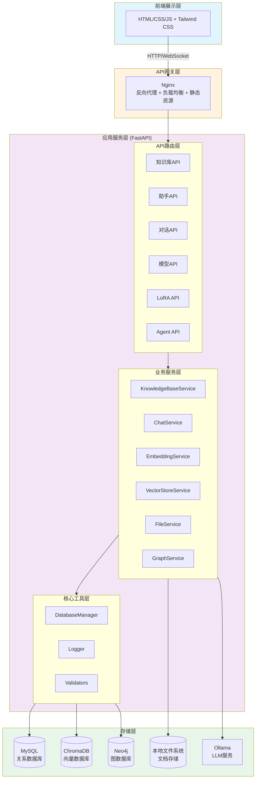

### 2.2 技术栈选型

#### 2.2.1 后端技术栈

| 技术类别 | 选型 | 版本 | 选型理由 |
|---------|------|------|---------|
| Web框架 | FastAPI | 0.104.1 | 高性能异步框架，自动API文档生成 |
| Python版本 | Python | 3.11+ | 性能优化，类型提示支持 |
| 数据库 | MySQL | 8.0 | 成熟稳定，事务支持，索引优化 |
| 向量数据库 | ChromaDB | 1.3.5+ | 轻量级，支持持久化，易于集成 |
| 图数据库 | Neo4j | 5.15 | 图查询性能优秀，Cypher语言简洁 |
| 数据库连接 | PyMySQL + DBUtils | - | 连接池管理，高并发支持 |
| ORM方式 | 原生SQL | - | 性能最优，灵活控制 |
| 异步支持 | asyncio | - | 提升并发处理能力 |
| LLM框架 | Transformers | 4.40.0+ | 本地模型推理，量化支持 |
| 嵌入模型 | Sentence Transformers | 2.7.0+ | 多语言支持，模型丰富 |
| 文档解析 | PyPDF2/python-docx/BS4 | - | 多格式支持 |
| 文本处理 | LangChain | 0.1.16 | 文本分割，链式调用 |

#### 2.2.2 前端技术栈

| 技术类别 | 选型 | 选型理由 |
|---------|------|---------|
| 基础技术 | HTML5/CSS3/ES6+ | 原生JavaScript，无框架依赖 |
| UI框架 | Tailwind CSS | 实用优先，快速开发 |
| 图标库 | Font Awesome | 图标丰富，易于使用 |
| Markdown渲染 | Marked.js | 实时渲染，代码高亮 |
| WebSocket | 原生WebSocket API | 实时通信，服务器推送 |

#### 2.2.3 部署技术栈

| 技术类别 | 选型 | 版本 | 用途 |
|---------|------|------|------|
| 容器化 | Docker | - | 应用容器化 |
| 编排工具 | Docker Compose | 3.8 | 多容器编排 |
| Web服务器 | Nginx | - | 反向代理，静态文件服务 |
| 进程管理 | Uvicorn | 0.24.0 | ASGI服务器 |
| AI服务 | Ollama | latest | 本地LLM服务 |

### 2.3 部署架构

#### 2.3.1 Docker容器化部署

系统采用Docker Compose进行容器编排，包含以下服务：

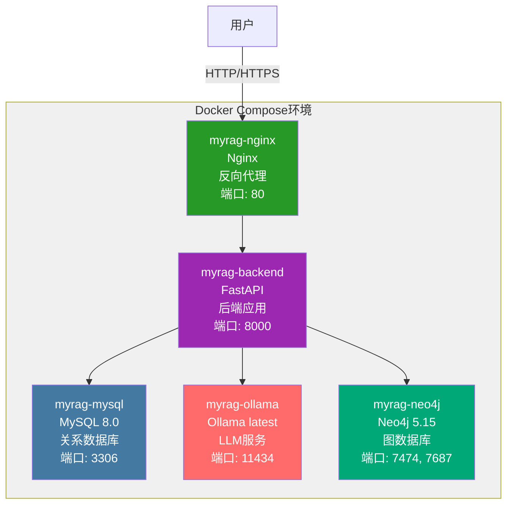

#### 2.3.2 网络与端口配置

| 服务 | 容器端口 | 宿主机端口 | 用途 |
|------|---------|-----------|------|
| Nginx | 80 | 80 | Web入口 |
| FastAPI | 8000 | 8000 | API服务 |
| MySQL | 3306 | 3306 | 数据库 |
| Neo4j HTTP | 7474 | 7474 | 图数据库UI |
| Neo4j Bolt | 7687 | 7687 | 图数据库连接 |
| Ollama | 11434 | 11434 | LLM服务 |

#### 2.3.3 数据持久化

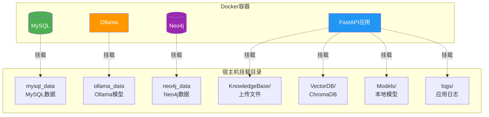

### 2.4 系统特性

#### 2.4.1 高可用性设计

- **数据库连接池**: DBUtils实现连接复用，支持10个并发连接
- **异常处理**: 统一的错误处理和日志记录
- **健康检查**: 提供/health端点监控服务状态
- **优雅关闭**: lifespan管理应用生命周期

#### 2.4.2 性能优化

- **异步IO**: FastAPI异步特性，提升并发处理能力
- **模型量化**: INT4量化降低显存占用（6GB显存可运行7B模型）
- **批处理**: 文本嵌入和实体提取支持批量处理
- **缓存策略**: 模型加载缓存，避免重复加载
- **流式响应**: 大语言模型输出采用流式传输

#### 2.4.3 扩展性设计

- **多Provider支持**: 抽象化的嵌入和LLM接口
- **插件化架构**: Agent工具可动态注册
- **配置驱动**: YAML配置文件统一管理参数
- **API版本控制**: RESTful API设计预留版本空间

---

## 3. 数据设计

### 3.1 数据库选型

系统采用**多数据库混合架构**，根据数据特性选择最合适的存储方案：

| 数据库类型 | 产品 | 用途 | 数据特点 |
|-----------|------|------|---------|
| 关系数据库 | MySQL 8.0 | 业务数据持久化 | 结构化、事务性、关系复杂 |
| 向量数据库 | ChromaDB | 文本向量存储 | 高维向量、相似度检索 |
| 图数据库 | Neo4j 5.15 | 知识图谱存储 | 实体关系、图遍历查询 |
| 文件系统 | 本地磁盘 | 原始文档存储 | 二进制文件、大容量 |

### 3.2 MySQL数据库设计

#### 3.2.1 核心表结构

系统包含**9个核心表**，分为4个业务领域：

**1. 知识库领域（4张表）**

```sql
-- 知识库表
knowledge_bases (
    id INT PRIMARY KEY AUTO_INCREMENT,
    name VARCHAR(255) UNIQUE NOT NULL,           -- 知识库名称
    description TEXT,                            -- 描述
    embedding_model VARCHAR(255) NOT NULL,       -- 嵌入模型
    embedding_provider VARCHAR(50) NOT NULL,     -- 提供方: transformers/ollama
    status VARCHAR(50) DEFAULT 'ready',          -- 状态: ready/processing/error
    file_count INT DEFAULT 0,                    -- 文件数量
    chunk_count INT DEFAULT 0,                   -- 文本块数量
    created_at TIMESTAMP DEFAULT CURRENT_TIMESTAMP,
    updated_at TIMESTAMP DEFAULT CURRENT_TIMESTAMP ON UPDATE CURRENT_TIMESTAMP,
    INDEX idx_name(name),
    INDEX idx_status(status)
)

-- 文件表
files (
    id INT PRIMARY KEY AUTO_INCREMENT,
    kb_id INT NOT NULL,                          -- 关联知识库
    filename VARCHAR(255) NOT NULL,              -- 原始文件名
    file_type VARCHAR(50) NOT NULL,              -- txt/pdf/docx/html/md
    file_size BIGINT NOT NULL,                   -- 文件大小(字节)
    file_hash VARCHAR(64) NOT NULL,              -- MD5哈希(去重)
    storage_path VARCHAR(512) NOT NULL,          -- 存储路径
    chunk_count INT DEFAULT 0,                   -- 文本块数量
    status VARCHAR(50) DEFAULT 'uploaded',       -- uploaded/parsing/completed/error
    error_message TEXT,                          -- 错误信息
    processed_at TIMESTAMP NULL,                 -- 处理完成时间
    created_at TIMESTAMP DEFAULT CURRENT_TIMESTAMP,
    FOREIGN KEY (kb_id) REFERENCES knowledge_bases(id) ON DELETE CASCADE,
    INDEX idx_kb_id(kb_id),
    INDEX idx_file_hash(file_hash)
)

-- 文本块表
text_chunks (
    id INT PRIMARY KEY AUTO_INCREMENT,
    kb_id INT NOT NULL,
    file_id INT NOT NULL,
    chunk_index INT NOT NULL,                    -- 块索引
    content TEXT NOT NULL,                       -- 文本内容
    vector_id VARCHAR(255) UNIQUE NOT NULL,      -- 向量数据库ID
    created_at TIMESTAMP DEFAULT CURRENT_TIMESTAMP,
    FOREIGN KEY (kb_id) REFERENCES knowledge_bases(id) ON DELETE CASCADE,
    FOREIGN KEY (file_id) REFERENCES files(id) ON DELETE CASCADE,
    INDEX idx_kb_id(kb_id),
    INDEX idx_file_id(file_id)
)

-- 处理日志表
process_logs (
    id INT PRIMARY KEY AUTO_INCREMENT,
    kb_id INT NOT NULL,
    file_id INT,
    operation VARCHAR(100) NOT NULL,             -- 操作类型
    status VARCHAR(50) NOT NULL,                 -- 状态
    message TEXT,                                -- 消息
    details JSON,                                -- 详细信息
    created_at TIMESTAMP DEFAULT CURRENT_TIMESTAMP,
    FOREIGN KEY (kb_id) REFERENCES knowledge_bases(id) ON DELETE CASCADE,
    INDEX idx_operation(operation)
)
```

**2. 智能助手领域（3张表）**

```sql
-- 智能助手表
assistants (
    id INT PRIMARY KEY AUTO_INCREMENT,
    name VARCHAR(255) NOT NULL,                  -- 助手名称
    description TEXT,                            -- 助手描述
    kb_ids VARCHAR(1000),                        -- 关联知识库ID(逗号分隔)
    embedding_model VARCHAR(255) NOT NULL,       -- 嵌入模型
    llm_model VARCHAR(255) NOT NULL,             -- 大语言模型
    llm_provider VARCHAR(50) DEFAULT 'local',    -- local/openai/azure/ollama
    system_prompt TEXT,                          -- 系统提示词
    color_theme VARCHAR(50) DEFAULT 'blue',      -- 卡片配色
    status VARCHAR(50) DEFAULT 'active',         -- active/inactive
    conversation_count INT DEFAULT 0,            -- 对话次数统计
    total_messages INT DEFAULT 0,                -- 总消息数统计
    last_conversation_at TIMESTAMP NULL,         -- 最后对话时间
    created_at TIMESTAMP DEFAULT CURRENT_TIMESTAMP,
    updated_at TIMESTAMP DEFAULT CURRENT_TIMESTAMP ON UPDATE CURRENT_TIMESTAMP,
    INDEX idx_status(status)
)

-- 对话表
conversations (
    id INT PRIMARY KEY AUTO_INCREMENT,
    assistant_id INT NOT NULL,                   -- 关联助手
    title VARCHAR(255) DEFAULT '新对话',        -- 对话标题
    message_count INT DEFAULT 0,                 -- 消息数量
    created_at TIMESTAMP DEFAULT CURRENT_TIMESTAMP,
    updated_at TIMESTAMP DEFAULT CURRENT_TIMESTAMP ON UPDATE CURRENT_TIMESTAMP,
    FOREIGN KEY (assistant_id) REFERENCES assistants(id) ON DELETE CASCADE,
    INDEX idx_assistant_id(assistant_id)
)

-- 消息表
messages (
    id INT PRIMARY KEY AUTO_INCREMENT,
    conversation_id INT NOT NULL,                -- 关联对话
    role VARCHAR(50) NOT NULL,                   -- user/assistant
    content TEXT NOT NULL,                       -- 消息内容
    sources JSON,                                -- RAG来源文档(仅assistant)
    created_at TIMESTAMP DEFAULT CURRENT_TIMESTAMP,
    FOREIGN KEY (conversation_id) REFERENCES conversations(id) ON DELETE CASCADE,
    INDEX idx_conversation_id(conversation_id)
)
```

**3. LoRA训练领域（2张表）**

```sql
-- LoRA模型管理表
lora_models (
    id INT PRIMARY KEY AUTO_INCREMENT,
    model_name VARCHAR(255) UNIQUE NOT NULL,     -- LoRA模型名称
    base_model VARCHAR(255) NOT NULL,            -- 基座模型
    model_path VARCHAR(500) NOT NULL,            -- 模型路径
    status ENUM('discovered','deploying','deployed','failed') DEFAULT 'discovered',
    is_deployed BOOLEAN DEFAULT FALSE,           -- 是否已部署
    ollama_model_name VARCHAR(255),              -- Ollama中的名称
    lora_rank INT,                               -- LoRA rank参数
    lora_alpha INT,                              -- LoRA alpha参数
    file_size_mb FLOAT DEFAULT 0,                -- 文件大小
    description TEXT,                            -- 模型描述
    created_at TIMESTAMP DEFAULT CURRENT_TIMESTAMP,
    deployed_at TIMESTAMP NULL,
    INDEX idx_status(status)
)

-- 简易LoRA训练任务表
simple_lora_tasks (
    id INT PRIMARY KEY AUTO_INCREMENT,
    task_name VARCHAR(255) NOT NULL,             -- 任务名称
    base_model VARCHAR(255) NOT NULL,            -- 基座模型
    dataset_name VARCHAR(255) NOT NULL,          -- 数据集名称
    output_dir VARCHAR(500) NOT NULL,            -- 输出目录
    status VARCHAR(50) DEFAULT 'pending',        -- pending/running/completed/failed
    progress INT DEFAULT 0,                      -- 训练进度(0-100)
    current_step INT DEFAULT 0,                  -- 当前步数
    total_steps INT DEFAULT 0,                   -- 总步数
    loss FLOAT,                                  -- 损失值
    learning_rate FLOAT DEFAULT 0.0001,          -- 学习率
    num_epochs INT DEFAULT 3,                    -- 训练轮数
    lora_rank INT DEFAULT 8,                     -- LoRA rank
    lora_alpha INT DEFAULT 16,                   -- LoRA alpha
    error_message TEXT,                          -- 错误信息
    started_at TIMESTAMP NULL,                   -- 开始时间
    completed_at TIMESTAMP NULL,                 -- 完成时间
    created_at TIMESTAMP DEFAULT CURRENT_TIMESTAMP,
    INDEX idx_status(status)
)
```

#### 3.2.2 数据库关系图（ER图）

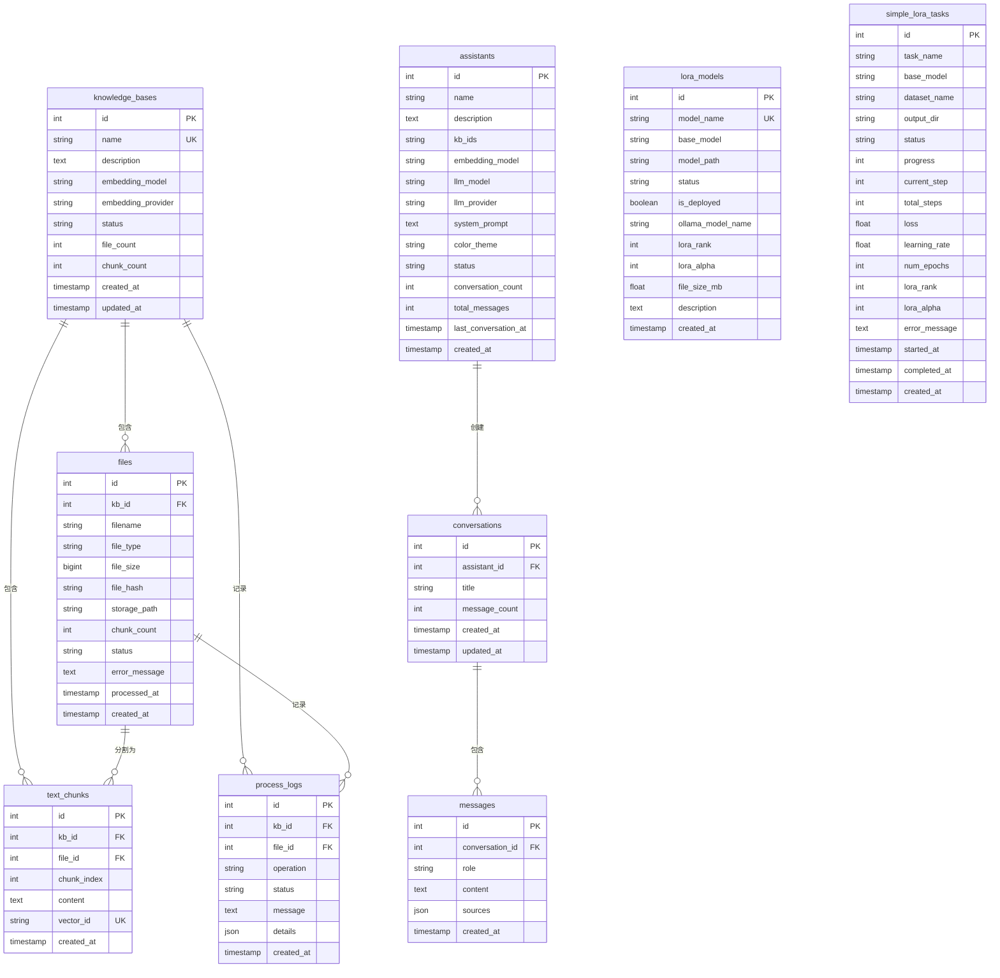

#### 3.2.3 索引设计

为提升查询性能，系统设计了以下索引策略：

| 表名 | 索引字段 | 索引类型 | 用途 |
|-----|---------|---------|------|
| knowledge_bases | name | UNIQUE | 知识库名称唯一性约束 |
| knowledge_bases | status | INDEX | 按状态过滤查询 |
| files | kb_id | INDEX | 查询知识库下的文件 |
| files | file_hash | INDEX | 文件去重检测 |
| text_chunks | vector_id | UNIQUE | 向量ID唯一性 |
| text_chunks | kb_id, file_id | INDEX | 多条件查询 |
| assistants | status | INDEX | 查询活跃助手 |
| conversations | assistant_id | INDEX | 查询助手的对话 |
| messages | conversation_id | INDEX | 查询对话的消息 |

### 3.3 向量数据库设计（ChromaDB）

#### 3.3.1 Collection命名规范

```
命名格式: kb_{kb_id}
示例: kb_1, kb_2, kb_3

每个知识库对应一个独立的Collection
```

#### 3.3.2 向量存储结构

```python
{
    "ids": ["chunk_1_0", "chunk_1_1", ...],           # 文本块ID
    "embeddings": [[0.1, 0.2, ...], ...],             # 向量（维度由模型决定）
    "documents": ["文本内容1", "文本内容2", ...],      # 原始文本
    "metadatas": [                                     # 元数据
        {
            "kb_id": "1",
            "file_id": "1",
            "filename": "example.txt",
            "chunk_index": "0"
        },
        ...
    ]
}
```

#### 3.3.3 检索策略

- **相似度算法**: 余弦相似度（Cosine Similarity）
- **默认检索数量**: top_k=5
- **过滤条件**: 支持metadata过滤（按kb_id、file_id）
- **混合检索**: 向量检索 + 图谱检索（权重配置）

### 3.4 图数据库设计（Neo4j）

#### 3.4.1 节点类型（Node Labels）

系统定义了**7种实体类型**：

```cypher
(:Person)         - 人物
(:Organization)   - 组织/机构
(:Location)       - 地点/位置
(:Product)        - 产品
(:Concept)        - 概念
(:Event)          - 事件
(:Date)           - 日期/时间
```

#### 3.4.2 节点属性

```cypher
节点通用属性:
{
    name: String,           -- 实体名称
    kb_id: Integer,         -- 所属知识库
    file_id: Integer,       -- 来源文件
    chunk_id: Integer,      -- 来源文本块
    type: String,           -- 实体类型
    created_at: DateTime    -- 创建时间
}
```

#### 3.4.3 关系类型（Relationship Types）

```cypher
常见关系类型:
-[:RELATED_TO]-      通用关联关系
-[:WORKS_FOR]-       工作关系（人物-组织）
-[:LOCATED_IN]-      位置关系
-[:PRODUCES]-        生产关系（组织-产品）
-[:BELONGS_TO]-      从属关系
-[:HAPPENED_AT]-     发生关系（事件-地点/时间）
```

#### 3.4.4 图查询示例

```cypher
-- 查询知识库的所有实体
MATCH (n)
WHERE n.kb_id = 1
RETURN n

-- 查询两个实体的最短路径
MATCH path = shortestPath(
    (a:Person {name: "张三"})-[*..3]-(b:Organization {name: "XX公司"})
)
RETURN path

-- 查询实体的邻居节点
MATCH (n {name: "张三"})-[r]-(m)
RETURN n, r, m
LIMIT 10
```

### 3.5 文件系统设计

#### 3.5.1 目录结构

```
KnowledgeBase/
├── kb_1/                           # 知识库1
│   ├── metadata.json               # 元数据文件
│   ├── file_1_example.txt          # 上传的文件
│   └── file_2_document.pdf
├── kb_2/                           # 知识库2
│   ├── metadata.json
│   └── ...
└── ...

Models/
├── Embedding/                      # 嵌入模型
│   ├── BERT-Base/
│   ├── all-MiniLM-L6-v2/
│   └── ...
├── LLM/                           # 大语言模型
│   ├── Qwen2.5-3B-Instruct/
│   ├── DeepSeek-OCR-3B/
│   └── ...
└── LoRA/                          # LoRA适配器
    ├── my_lora_model/
    └── ...

VectorDB/                          # ChromaDB持久化
├── chroma.sqlite3                 # 元数据数据库
├── 17fcea8d-.../                  # Collection数据
└── ...

TrainingData/                      # 训练数据集
├── example_dataset.json
└── ...
```

#### 3.5.2 文件命名规范

```
上传文件命名: file_{file_id}_{original_filename}
示例: file_123_example.txt

元数据文件命名: metadata.json
```

### 3.6 数据流设计

#### 3.6.1 文件上传与处理流程

```
用户上传文件
    ↓
[1] 文件验证（类型、大小、MD5去重）
    ↓
[2] 保存到文件系统（KnowledgeBase/kb_{id}/）
    ↓
[3] 创建files记录（status=uploaded）
    ↓
[4] 文本提取（PDF/DOCX/TXT/HTML/MD解析）
    ↓
[5] 文本分割（递归分割 + 语义分割）
    ↓
[6] 文本向量化（批量embedding）
    ↓
[7] 存入ChromaDB（Collection=kb_{id}）
    ↓
[8] 创建text_chunks记录
    ↓
[9] 更新files.status=completed
    ↓
[10] 更新knowledge_bases统计（file_count、chunk_count）
    ↓
[11] WebSocket推送进度（可选）
```

#### 3.6.2 RAG对话流程

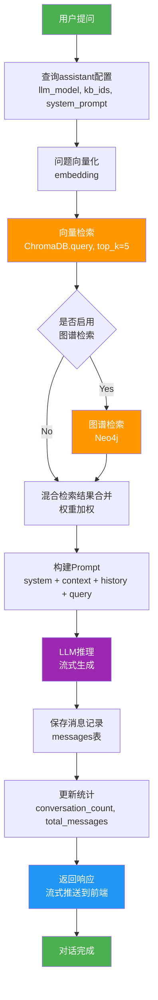

#### 3.6.3 知识图谱构建流程

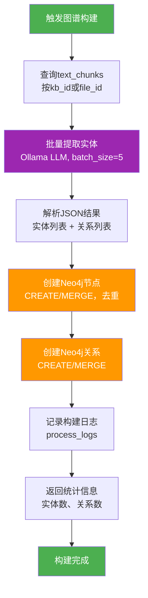

### 3.7 数据一致性保证

#### 3.7.1 事务处理

- **MySQL事务**: 所有写操作使用事务保证原子性
- **级联删除**: 知识库删除时自动清理关联数据（CASCADE）
- **外键约束**: 保证引用完整性

#### 3.7.2 数据同步

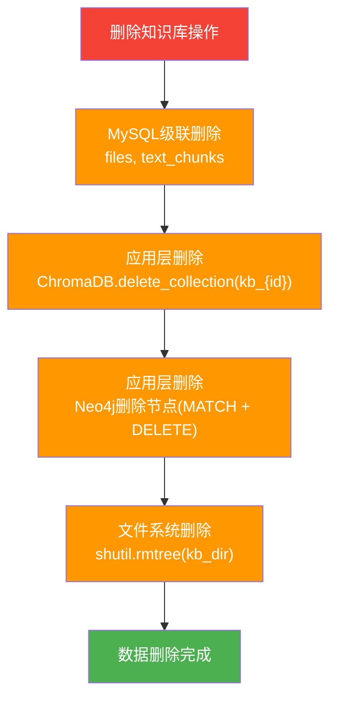

#### 3.7.3 数据备份策略

- **MySQL**: 每日全量备份 + binlog增量备份
- **ChromaDB**: 持久化目录定期备份
- **Neo4j**: neo4j-admin backup定期备份
- **文件系统**: rsync增量备份

---

## 4. 功能模块设计

### 4.1 模块总览

系统按照业务功能划分为**8个核心模块**：

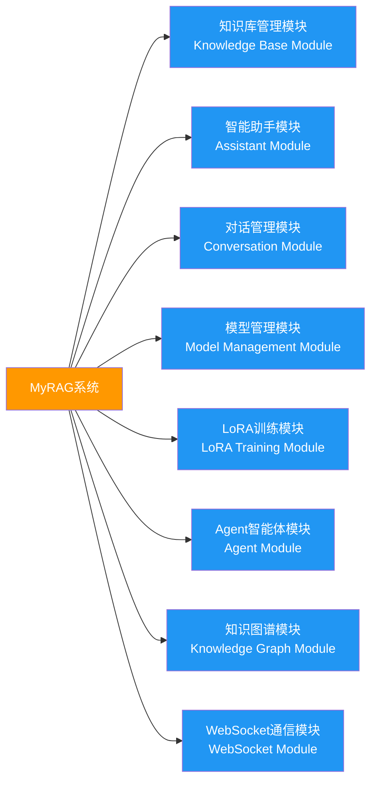

### 4.2 知识库管理模块

#### 4.2.1 模块职责

- 知识库的CRUD操作
- 文件上传与管理
- 文本提取与分割
- 向量化与存储
- 知识检索

#### 4.2.2 核心服务

| 服务名称 | 文件位置 | 主要功能 |
|---------|---------|---------|
| KnowledgeBaseService | services/knowledge_base_service.py | 知识库CRUD、统计查询 |
| FileService | services/file_service.py | 文件保存、解析、文本提取 |
| EmbeddingService | services/embedding_service.py | 文本向量化（Transformers） |
| OllamaEmbeddingService | services/ollama_embedding_service.py | 文本向量化（Ollama） |
| VectorStoreService | services/vector_store_service.py | ChromaDB操作 |
| TextSplitter | utils/text_splitter.py | 文本分割（递归+语义） |

#### 4.2.3 功能流程

**创建知识库**:
1. 验证知识库名称唯一性
2. 插入knowledge_bases表
3. 创建文件存储目录（KnowledgeBase/kb_{id}/）
4. 创建元数据文件（metadata.json）
5. 创建ChromaDB Collection（kb_{id}）

**文件上传**:
1. 验证文件类型和大小
2. 计算MD5哈希（去重检测）
3. 保存文件到kb_dir
4. 插入files表（status=uploaded）
5. 后台任务处理：文本提取 → 分割 → 向量化 → 存储
6. WebSocket推送进度

**文本检索**:
1. 问题向量化（embedding）
2. ChromaDB相似度检索（top_k）
3. 返回结果（content + metadata + similarity）

#### 4.2.4 配置参数

```yaml
file:
  max_size_mb: 100                    # 单文件最大100MB
  allowed_extensions: [.txt, .pdf, .docx, .html, .md, .json]

text_processing:
  chunk_size: 800                     # 块大小
  chunk_overlap: 100                  # 重叠大小
  semantic_split:
    enabled: true                     # 启用语义分割
    ollama_model: "deepseek-v3.1"    # 语义判断模型

embedding:
  provider: "transformers"            # transformers/ollama
  default_model: "BERT-Base"
  batch_size: 32
```

### 4.3 智能助手模块

#### 4.3.1 模块职责

- 智能助手的CRUD操作
- 助手配置管理（模型、知识库、提示词）
- 助手统计与分析

#### 4.3.2 核心功能

**助手创建**:
- 关联多个知识库（必须使用相同embedding_model）
- 选择LLM模型（本地/Ollama）
- 自定义系统提示词
- 配色主题选择（blue/purple/orange/green/pink）

**提示词模板**:
系统内置5种提示词模板：
1. 通用对话助手
2. 知识库问答助手
3. 产品顾问
4. 研发助手
5. 销售助手

**助手配置**:
```python
{
    "name": "助手名称",
    "kb_ids": [1, 2, 3],              # 关联知识库
    "embedding_model": "BERT-Base",   # 继承自知识库
    "llm_model": "Qwen2.5-3B",        # LLM模型
    "llm_provider": "transformers",   # local/ollama
    "system_prompt": "你是...",       # 系统提示词
    "color_theme": "blue"             # 配色主题
}
```

#### 4.3.3 模型验证

- **本地模型**: 扫描Models/LLM/目录验证存在性
- **Ollama模型**: 调用Ollama API验证可用性
- **嵌入模型**: 验证知识库间的一致性

### 4.4 对话管理模块

#### 4.4.1 模块职责

- 对话会话管理
- 消息存储与检索
- RAG增强对话
- 流式响应生成

#### 4.4.2 核心服务

| 服务名称 | 文件位置 | 主要功能 |
|---------|---------|---------|
| ChatService | services/chat_service.py | RAG对话、Prompt构建 |
| TransformersService | services/transformers_service.py | 本地模型推理 |
| OllamaLLMService | services/ollama_llm_service.py | Ollama模型推理 |
| HybridRetrievalService | services/hybrid_retrieval_service.py | 混合检索 |

#### 4.4.3 对话流程

**标准RAG对话**:
```
用户问题
  ↓
1. 查询助手配置（kb_ids, llm_model, system_prompt）
  ↓
2. 问题向量化（embedding）
  ↓
3. 向量检索（ChromaDB，top_k=5）
  ↓
4. 构建上下文（格式化检索结果）
  ↓
5. 构建Prompt:
   - System: system_prompt
   - History: 最近4轮对话
   - Context: 检索到的文档
   - User: 当前问题
  ↓
6. LLM推理（流式生成）
  ↓
7. 保存消息（messages表，含sources）
  ↓
8. 更新统计（conversation_count++）
  ↓
9. 返回响应（SSE流式推送）
```

**混合检索模式**:
```
向量检索（权重0.6）+ 图谱检索（权重0.4）
  ↓
结果归一化
  ↓
加权合并
  ↓
按分数排序（top_k）
```

#### 4.4.4 上下文管理

- **记忆窗口**: 保留最近4轮对话（2个user + 2个assistant）
- **上下文长度**: 动态控制在模型max_length内
- **历史优先**: 对话历史约定优先于检索上下文

#### 4.4.5 流式响应

```python
# SSE流式传输格式
data: {"type": "start", "message": "开始生成"}
data: {"type": "token", "content": "你"}
data: {"type": "token", "content": "好"}
data: {"type": "end", "sources": [...]}
```

### 4.5 模型管理模块

#### 4.5.1 模块职责

- 本地模型扫描与管理
- Ollama模型集成
- 模型使用情况统计
- 模型删除（含依赖检查）

#### 4.5.2 核心服务

| 服务名称 | 文件位置 | 主要功能 |
|---------|---------|---------|
| ModelScanner | services/model_scanner.py | 扫描本地模型目录 |
| ModelManager | services/model_manager.py | 模型CRUD、依赖检查 |
| LoRAScannerService | services/lora_scanner_service.py | LoRA模型扫描 |

#### 4.5.3 模型类型

**1. 嵌入模型（Embedding Models）**
- 目录: `Models/Embedding/`
- 检测: 存在pytorch_model.bin或model.safetensors
- 用途: 文本向量化

**2. LLM模型（Large Language Models）**
- 目录: `Models/LLM/`
- 检测: 存在config.json + 模型文件
- 用途: 文本生成、对话

**3. LoRA模型（LoRA Adapters）**
- 目录: `Models/LoRA/`
- 检测: 存在adapter_config.json
- 用途: 模型微调适配器

**4. Ollama模型**
- 来源: 本地Ollama服务 + 云端API
- 检测: /api/tags接口查询
- 用途: LLM和Embedding

#### 4.5.4 模型扫描

```python
扫描结果格式:
{
    "name": "BERT-Base",              # 模型名称
    "path": "/path/to/model",         # 模型路径
    "type": "embedding",              # 类型
    "size": "420MB",                  # 大小
    "status": "available",            # 状态
    "can_delete": True,               # 是否可删除
    "usage": {                        # 使用情况
        "is_used": True,
        "knowledge_bases": [1, 2],
        "assistants": [3]
    }
}
```

#### 4.5.5 删除保护

删除模型前检查依赖：
- 嵌入模型: 检查knowledge_bases表
- LLM模型: 检查assistants表
- 有依赖时禁止删除（除非force=true）

### 4.6 LoRA训练模块

#### 4.6.1 模块职责

- LoRA模型训练（简易模式）
- LLaMA-Factory集成（完整模式）
- 训练任务管理
- 模型部署到Ollama

#### 4.6.2 训练模式

**1. 简易训练（Simple LoRA）**
- 快速上手，参数简化
- 支持基本LoRA参数配置
- 训练任务状态跟踪
- 进度实时推送

**2. 完整训练（LLaMA-Factory）**
- 专业训练平台
- 支持多种训练方法（LoRA/QLoRA/Full）
- Web UI可视化配置
- 训练日志完整

#### 4.6.3 核心服务

| 服务名称 | 文件位置 | 主要功能 |
|---------|---------|---------|
| SimpleLoRATrainer | services/simple_lora_trainer.py | 简易训练实现 |
| LlamaFactoryService | services/llama_factory_service.py | LLaMA-Factory集成 |

#### 4.6.4 训练流程

**简易训练流程**:
```
1. 上传数据集（JSON格式）
  ↓
2. 创建训练任务（simple_lora_tasks表）
  ↓
3. 启动后台训练进程
  ↓
4. 实时更新进度（progress, current_step, loss）
  ↓
5. 训练完成，保存LoRA到Models/LoRA/
  ↓
6. 扫描并注册到lora_models表
  ↓
7. （可选）部署到Ollama
```

**训练参数**:
```python
{
    "task_name": "我的训练任务",
    "base_model": "Qwen2.5-3B",
    "dataset_name": "my_dataset.json",
    "learning_rate": 0.0001,
    "num_epochs": 3,
    "lora_rank": 8,
    "lora_alpha": 16
}
```

#### 4.6.5 数据集格式

```json
[
    {
        "instruction": "问题或指令",
        "input": "输入内容（可选）",
        "output": "期望输出"
    }
]
```

### 4.7 Agent智能体模块

#### 4.7.1 模块职责

- 工具调用管理
- 多步骤任务执行
- 思维链推理
- 工具动态注册

#### 4.7.2 核心架构

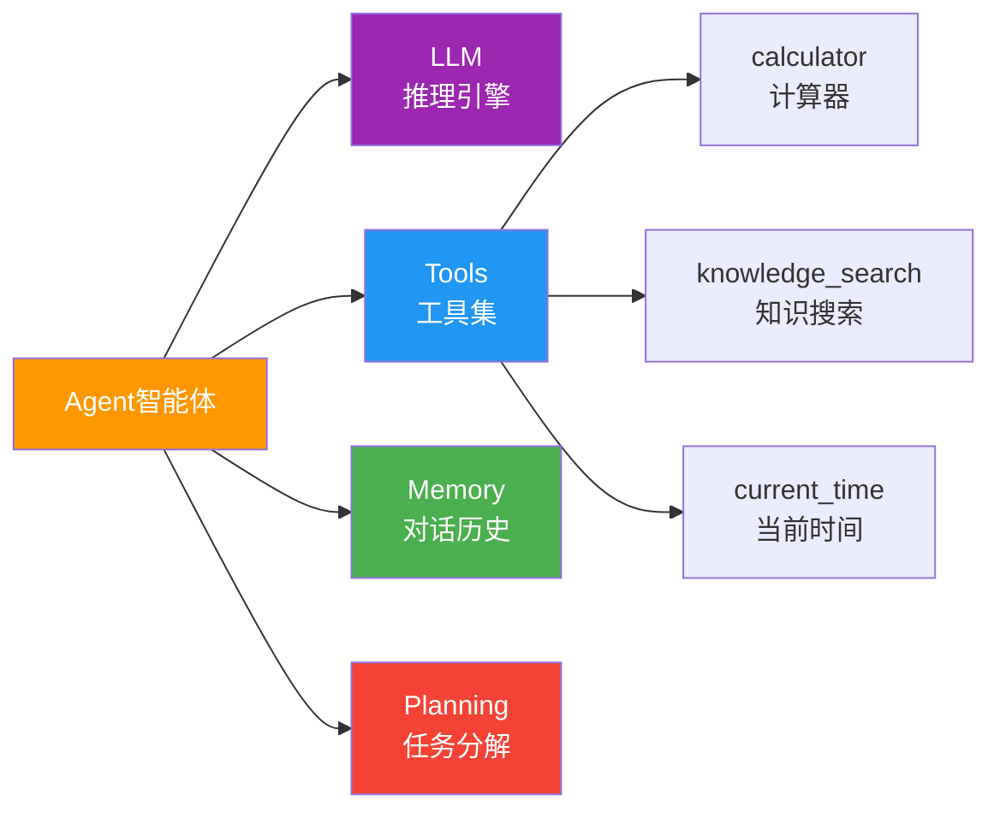

**组件说明**：
- **LLM**: 推理引擎（Ollama）
- **Tools**: 可调用工具集
- **Memory**: 对话历史
- **Planning**: 任务分解与执行

#### 4.7.3 内置工具

系统预定义3个工具：

**1. calculator（计算器）**
```python
功能: 执行数学表达式计算
输入: expression (str)
输出: 计算结果
示例: "2 + 3 * 4" → 14
```

**2. knowledge_search（知识搜索）**
```python
功能: 在知识库中搜索信息
输入: query (str), kb_id (int)
输出: 搜索结果列表
示例: "Python异步编程" → [...文档...]
```

**3. current_time（当前时间）**
```python
功能: 获取当前时间
输入: 无
输出: ISO格式时间字符串
示例: "2025-11-25T10:30:00"
```

#### 4.7.4 工具调用流程

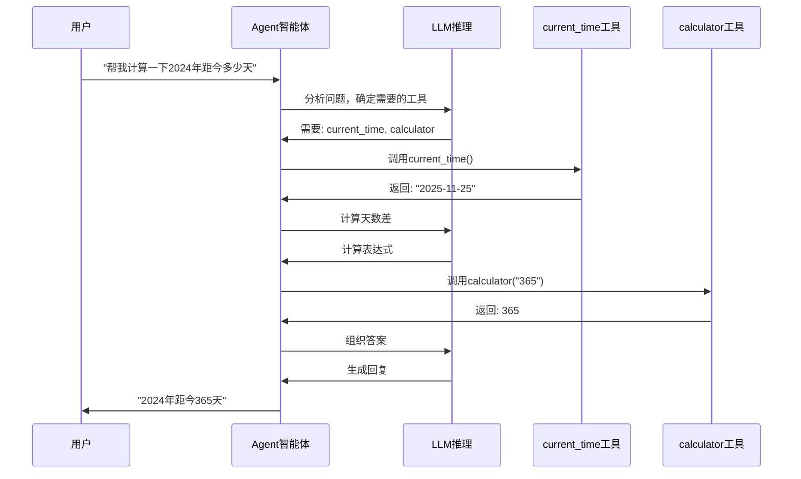

#### 4.7.5 工具注册

支持动态注册新工具：
```python
{
    "name": "weather_query",
    "description": "查询城市天气",
    "parameters": {
        "city": "城市名称"
    },
    "implementation": "function_reference"
}
```

### 4.8 知识图谱模块

#### 4.8.1 模块职责

- 实体自动提取
- 关系识别与构建
- 图谱查询与统计
- 图检索增强

#### 4.8.2 核心服务

| 服务名称 | 文件位置 | 主要功能 |
|---------|---------|---------|
| Neo4jGraphService | services/neo4j_graph_service.py | Neo4j CRUD操作 |
| EntityExtractionService | services/entity_extraction_service.py | 实体提取 |

#### 4.8.3 实体提取

**提取方法**: 
- 使用Ollama LLM（deepseek-v3.1）
- Prompt工程：要求返回JSON格式
- 批量处理（batch_size=5）

**提取结果**:
```json
{
    "entities": [
        {
            "name": "张三",
            "type": "Person"
        },
        {
            "name": "XX公司",
            "type": "Organization"
        }
    ],
    "relationships": [
        {
            "source": "张三",
            "target": "XX公司",
            "type": "WORKS_FOR"
        }
    ]
}
```

#### 4.8.4 图谱构建

**构建策略**:
- 增量构建（不覆盖已有数据）
- 节点去重（MERGE语句）
- 关系去重
- 元数据关联（kb_id, file_id）

**Cypher语句**:
```cypher
-- 创建节点
MERGE (n:Person {name: $name})
ON CREATE SET n.kb_id = $kb_id, n.created_at = datetime()

-- 创建关系
MATCH (a {name: $source}), (b {name: $target})
MERGE (a)-[r:WORKS_FOR]->(b)
```

#### 4.8.5 图谱查询

**统计查询**:
- 总节点数
- 总关系数
- 各类型实体数量
- 各类型关系数量

**检索查询**:
- 实体搜索（名称模糊匹配）
- 关系查询（最短路径、邻居节点）
- 图遍历（深度限制）

### 4.9 WebSocket通信模块

#### 4.9.1 模块职责

- 实时进度推送
- 双向通信管理
- 连接状态维护
- 心跳检测

#### 4.9.2 通信场景

**1. 文件处理进度**:
```json
{
    "type": "progress",
    "stage": "parsing",
    "progress": 50,
    "message": "正在解析文档..."
}
```

**2. 训练进度**:
```json
{
    "type": "training_progress",
    "task_id": 123,
    "progress": 75,
    "current_step": 750,
    "total_steps": 1000,
    "loss": 0.123
}
```

**3. 系统通知**:
```json
{
    "type": "notification",
    "level": "info",
    "message": "知识库构建完成"
}
```

#### 4.9.3 连接管理

```python
class ConnectionManager:
    active_connections: Dict[str, WebSocket]  # client_id -> WebSocket
    
    方法:
    - connect(client_id, websocket)           # 建立连接
    - disconnect(client_id)                   # 断开连接
    - send_message(client_id, message)        # 发送消息
    - broadcast(message)                      # 广播消息
```

#### 4.9.4 心跳机制

- 客户端每30秒发送ping
- 服务端响应pong
- 超时未响应则断开连接

---

## 5. API接口设计

### 5.1 接口概览

系统提供**8组RESTful API**，共计**60+个接口**：

| API组 | 路由前缀 | 接口数 | 主要功能 |
|-------|---------|-------|---------|
| 知识库API | /api/knowledge-bases | 12 | 知识库CRUD、文件管理、检索 |
| 智能助手API | /api/assistants | 8 | 助手CRUD、模板管理 |
| 对话API | /api/conversations | 10 | 对话管理、消息发送、流式响应 |
| 模型API | /api/models | 15 | 模型扫描、管理、删除 |
| LoRA训练API | /api/lora | 8 | 训练任务、模型管理 |
| 简易LoRA API | /api/simple-lora | 6 | 简易训练、数据集管理 |
| Agent API | /api/agent | 4 | Agent问答、工具管理 |
| WebSocket API | /ws | 1 | 实时通信 |

### 5.2 知识库API

#### 5.2.1 创建知识库

```http
POST /api/knowledge-bases
Content-Type: application/json

Request:
{
    "name": "技术文档库",
    "description": "公司技术文档集合",
    "embedding_model": "BERT-Base",
    "embedding_provider": "transformers"
}

Response (201):
{
    "id": 1,
    "name": "技术文档库",
    "description": "公司技术文档集合",
    "embedding_model": "BERT-Base",
    "embedding_provider": "transformers",
    "status": "ready",
    "file_count": 0,
    "chunk_count": 0,
    "created_at": "2025-11-25T10:00:00",
    "updated_at": "2025-11-25T10:00:00"
}
```

#### 5.2.2 获取知识库列表

```http
GET /api/knowledge-bases?skip=0&limit=10

Response (200):
[
    {
        "id": 1,
        "name": "技术文档库",
        "status": "ready",
        "file_count": 5,
        "chunk_count": 150,
        "graph_stats": {
            "total_entities": 120,
            "total_relationships": 45
        },
        ...
    }
]
```

#### 5.2.3 上传文件

```http
POST /api/knowledge-bases/{kb_id}/files
Content-Type: multipart/form-data

Request:
- file: (binary)
- client_id: "user123" (可选，用于WebSocket推送)

Response (200):
{
    "success": true,
    "file_id": 1,
    "filename": "document.pdf",
    "message": "文件上传成功，正在后台处理"
}
```

#### 5.2.4 文件列表

```http
GET /api/knowledge-bases/{kb_id}/files

Response (200):
{
    "files": [
        {
            "id": 1,
            "filename": "document.pdf",
            "file_type": "pdf",
            "file_size": 1048576,
            "chunk_count": 30,
            "status": "completed",
            "created_at": "2025-11-25T10:00:00"
        }
    ]
}
```

#### 5.2.5 删除文件

```http
DELETE /api/knowledge-bases/{kb_id}/files/{file_id}

Response (200):
{
    "message": "文件已删除"
}
```

#### 5.2.6 知识检索

```http
POST /api/knowledge-bases/search
Content-Type: application/json

Request:
{
    "kb_id": 1,
    "query": "如何使用RAG技术",
    "top_k": 5
}

Response (200):
{
    "results": [
        {
            "content": "RAG技术是...",
            "metadata": {
                "filename": "rag_intro.txt",
                "chunk_index": 0
            },
            "similarity": 0.89
        }
    ]
}
```

#### 5.2.7 构建知识图谱

```http
POST /api/knowledge-bases/{kb_id}/build-graph
Content-Type: application/json

Request:
{
    "file_ids": [1, 2, 3]  # 可选，不传则处理所有文件
}

Response (200):
{
    "message": "知识图谱构建完成",
    "entities_created": 50,
    "relationships_created": 30
}
```

#### 5.2.8 获取图谱统计

```http
GET /api/knowledge-bases/{kb_id}/graph-stats

Response (200):
{
    "total_entities": 120,
    "total_relationships": 45,
    "entity_types": {
        "Person": 30,
        "Organization": 20,
        "Location": 15,
        ...
    },
    "relationship_types": {
        "WORKS_FOR": 10,
        "LOCATED_IN": 8,
        ...
    }
}
```

### 5.3 智能助手API

#### 5.3.1 创建助手

```http
POST /api/assistants
Content-Type: application/json

Request:
{
    "name": "技术支持助手",
    "description": "帮助解决技术问题",
    "kb_ids": [1, 2],
    "llm_model": "Qwen2.5-3B-Instruct",
    "llm_provider": "transformers",
    "system_prompt": "你是一个专业的技术支持助手",
    "color_theme": "blue"
}

Response (201):
{
    "id": 1,
    "name": "技术支持助手",
    "kb_ids": [1, 2],
    "kb_names": ["技术文档库", "产品手册"],
    "embedding_model": "BERT-Base",
    "llm_model": "Qwen2.5-3B-Instruct",
    "status": "active",
    ...
}
```

#### 5.3.2 获取助手列表

```http
GET /api/assistants

Response (200):
{
    "assistants": [
        {
            "id": 1,
            "name": "技术支持助手",
            "status": "active",
            "conversation_count": 10,
            "total_messages": 50,
            "last_conversation_at": "2025-11-25T10:00:00",
            ...
        }
    ]
}
```

#### 5.3.3 获取提示词模板

```http
GET /api/assistants/prompt-templates

Response (200):
{
    "templates": [
        {
            "name": "通用对话助手",
            "description": "适合日常交流的友好助手",
            "content": "你是一个友好、专业的AI助手..."
        },
        ...
    ]
}
```

#### 5.3.4 更新助手

```http
PUT /api/assistants/{assistant_id}
Content-Type: application/json

Request:
{
    "system_prompt": "新的系统提示词",
    "color_theme": "purple"
}

Response (200):
{
    "message": "助手更新成功",
    "assistant": {...}
}
```

#### 5.3.5 删除助手

```http
DELETE /api/assistants/{assistant_id}?force=false

Response (200):
{
    "message": "助手已删除"
}
```

### 5.4 对话API

#### 5.4.1 创建对话

```http
POST /api/conversations
Content-Type: application/json

Request:
{
    "assistant_id": 1,
    "title": "技术问题咨询"
}

Response (201):
{
    "id": 1,
    "assistant_id": 1,
    "title": "技术问题咨询",
    "message_count": 0,
    "created_at": "2025-11-25T10:00:00"
}
```

#### 5.4.2 获取对话列表

```http
GET /api/conversations?assistant_id=1&limit=20

Response (200):
{
    "conversations": [
        {
            "id": 1,
            "title": "技术问题咨询",
            "message_count": 10,
            "updated_at": "2025-11-25T10:00:00"
        }
    ]
}
```

#### 5.4.3 发送消息（流式响应）

```http
POST /api/conversations/{conversation_id}/chat/stream
Content-Type: application/json

Request:
{
    "query": "什么是RAG技术？",
    "temperature": 0.7,
    "max_tokens": 2048,
    "max_history_turns": 10,
    "use_hybrid_retrieval": false
}

Response (200):
Content-Type: text/event-stream

data: {"type": "start", "message": "开始生成回答"}

data: {"type": "token", "content": "RAG"}

data: {"type": "token", "content": "技术"}

data: {"type": "end", "sources": [{"filename": "rag_intro.txt", "similarity": 0.89}]}
```

#### 5.4.4 获取对话消息

```http
GET /api/conversations/{conversation_id}/messages?limit=50

Response (200):
{
    "messages": [
        {
            "id": 1,
            "role": "user",
            "content": "什么是RAG技术？",
            "created_at": "2025-11-25T10:00:00"
        },
        {
            "id": 2,
            "role": "assistant",
            "content": "RAG是检索增强生成...",
            "sources": [...],
            "created_at": "2025-11-25T10:00:05"
        }
    ]
}
```

#### 5.4.5 删除对话

```http
DELETE /api/conversations/{conversation_id}

Response (200):
{
    "message": "对话已删除"
}
```

#### 5.4.6 清空对话消息

```http
DELETE /api/conversations/{conversation_id}/messages

Response (200):
{
    "message": "对话消息已清空"
}
```

### 5.5 模型管理API

#### 5.5.1 获取嵌入模型列表

```http
GET /api/models/embedding

Response (200):
{
    "success": true,
    "total": 3,
    "models": [
        {
            "name": "BERT-Base",
            "path": "/path/to/model",
            "type": "embedding",
            "size": "420MB",
            "status": "available",
            "can_delete": true,
            "usage": {
                "is_used": true,
                "knowledge_bases": [1, 2],
                "total_usage": 2
            }
        }
    ]
}
```

#### 5.5.2 获取LLM模型列表

```http
GET /api/models/llm

Response (200):
{
    "success": true,
    "local": [
        {
            "name": "Qwen2.5-3B-Instruct",
            "path": "/path/to/model",
            "type": "llm",
            "size": "6.5GB",
            "status": "available",
            "usage": {...}
        }
    ],
    "remote": [
        {
            "name": "deepseek-v3.1:671b-cloud",
            "type": "ollama",
            "status": "available",
            "can_delete": false
        }
    ]
}
```

#### 5.5.3 删除模型

```http
DELETE /api/models/embedding/{model_name}?force=false

Response (200):
{
    "success": true,
    "message": "模型删除成功"
}

或者（有依赖时）:
{
    "success": false,
    "message": "模型正在被使用，无法删除",
    "usage": {
        "knowledge_bases": [1, 2]
    }
}
```

#### 5.5.4 扫描模型目录

```http
POST /api/models/embedding/scan

Response (200):
{
    "success": true,
    "message": "扫描完成",
    "total": 3,
    "models": [...]
}
```

### 5.6 LoRA训练API

#### 5.6.1 上传数据集

```http
POST /api/simple-lora/upload-dataset
Content-Type: multipart/form-data

Request:
- dataset: (JSON file)

Response (200):
{
    "success": true,
    "dataset_name": "my_dataset.json",
    "sample_count": 100,
    "message": "数据集上传成功"
}
```

#### 5.6.2 创建训练任务

```http
POST /api/simple-lora/train
Content-Type: application/json

Request:
{
    "task_name": "客服助手微调",
    "base_model": "Qwen2.5-3B-Instruct",
    "dataset_name": "customer_service.json",
    "learning_rate": 0.0001,
    "num_epochs": 3,
    "lora_rank": 8,
    "lora_alpha": 16
}

Response (200):
{
    "success": true,
    "task_id": 1,
    "message": "训练任务已创建并开始执行"
}
```

#### 5.6.3 获取训练状态

```http
GET /api/simple-lora/tasks/{task_id}

Response (200):
{
    "task_id": 1,
    "task_name": "客服助手微调",
    "status": "running",
    "progress": 65,
    "current_step": 650,
    "total_steps": 1000,
    "loss": 0.234,
    "started_at": "2025-11-25T10:00:00"
}
```

#### 5.6.4 获取训练任务列表

```http
GET /api/simple-lora/tasks

Response (200):
{
    "tasks": [
        {
            "task_id": 1,
            "task_name": "客服助手微调",
            "status": "completed",
            "progress": 100,
            ...
        }
    ]
}
```

#### 5.6.5 获取可用模型列表

```http
GET /api/simple-lora/models

Response (200):
{
    "models": [
        {
            "name": "Qwen2.5-3B-Instruct",
            "path": "/path/to/model",
            "size": "6.5GB",
            "status": "available"
        }
    ]
}
```

### 5.7 Agent API

#### 5.7.1 Agent问答

```http
POST /api/agent/query
Content-Type: application/json

Request:
{
    "query": "帮我计算2024年全年的工作日数量",
    "session_id": "session_123",
    "max_iterations": 5
}

Response (200):
{
    "answer": "2024年共有252个工作日",
    "steps": [
        {
            "iteration": 1,
            "thought": "需要获取当前日期并计算天数差",
            "action": "current_time",
            "result": "2025-11-25"
        },
        {
            "iteration": 2,
            "thought": "使用计算器计算工作日",
            "action": "calculator",
            "result": "252"
        }
    ],
    "success": true,
    "iterations": 2
}
```

#### 5.7.2 获取可用工具

```http
GET /api/agent/tools

Response (200):
[
    {
        "name": "calculator",
        "description": "执行数学计算"
    },
    {
        "name": "knowledge_search",
        "description": "在知识库中搜索信息"
    },
    {
        "name": "current_time",
        "description": "获取当前时间"
    }
]
```

#### 5.7.3 注册工具

```http
POST /api/agent/register-tool
Content-Type: application/json

Request:
{
    "name": "weather_query",
    "description": "查询城市天气",
    "parameters": {
        "city": "城市名称"
    }
}

Response (200):
{
    "message": "工具注册成功",
    "tool_name": "weather_query"
}
```

#### 5.7.4 健康检查

```http
GET /api/agent/health

Response (200):
{
    "status": "healthy",
    "ollama_available": true,
    "tools_count": 3
}
```

### 5.8 WebSocket API

#### 5.8.1 建立连接

```javascript
const ws = new WebSocket('ws://localhost:8000/ws/{client_id}');

ws.onopen = () => {
    console.log('WebSocket连接已建立');
};

ws.onmessage = (event) => {
    const data = JSON.parse(event.data);
    console.log('收到消息:', data);
    
    switch(data.type) {
        case 'progress':
            // 处理进度更新
            break;
        case 'notification':
            // 处理系统通知
            break;
        case 'training_progress':
            // 处理训练进度
            break;
    }
};

ws.onerror = (error) => {
    console.error('WebSocket错误:', error);
};

ws.onclose = () => {
    console.log('WebSocket连接已关闭');
};
```

#### 5.8.2 消息格式

**文件处理进度**:
```json
{
    "type": "progress",
    "stage": "parsing",
    "progress": 50,
    "message": "正在解析文档: example.pdf",
    "file_id": 1
}
```

**训练进度**:
```json
{
    "type": "training_progress",
    "task_id": 1,
    "progress": 75,
    "current_step": 750,
    "total_steps": 1000,
    "loss": 0.123,
    "estimated_time": 300
}
```

**系统通知**:
```json
{
    "type": "notification",
    "level": "info",
    "message": "知识图谱构建完成",
    "data": {
        "kb_id": 1,
        "entities": 120,
        "relationships": 45
    }
}
```

### 5.9 通用响应格式

#### 5.9.1 成功响应

```json
{
    "success": true,
    "message": "操作成功",
    "data": {...}
}
```

#### 5.9.2 错误响应

```json
{
    "detail": "错误描述",
    "status_code": 400/404/500
}
```

常见HTTP状态码：
- 200: 成功
- 201: 创建成功
- 400: 请求参数错误
- 404: 资源不存在
- 500: 服务器内部错误

### 5.10 API认证与安全

#### 5.10.1 CORS配置

```python
allow_origins: ["http://localhost", "http://127.0.0.1"]
allow_methods: ["*"]
allow_headers: ["*"]
allow_credentials: True
```

#### 5.10.2 请求限制

- 文件上传大小限制: 100MB/文件
- 总上传大小限制: 500MB
- 并发连接限制: 100个WebSocket连接
- 请求超时: 30秒（可配置）

#### 5.10.3 数据验证

- 使用Pydantic进行请求体验证
- 文件类型白名单验证
- SQL注入防护（参数化查询）
- XSS防护（输入转义）

---

## 6. 技术方案和非功能性需求

### 6.1 关键技术方案

#### 6.1.1 文本处理技术

**1. 递归文本分割（Recursive Text Splitting）**

采用LangChain的RecursiveCharacterTextSplitter：

```python
策略:
1. 按分隔符优先级递归分割: \n\n → \n → 。→ ！→ ？
2. 块大小: 800字符
3. 重叠大小: 100字符（保持上下文连贯性）
4. 长度计算: len()函数
```

优势：
- 保持段落完整性
- 避免截断句子
- 提升检索质量

**2. 语义分割（Semantic Splitting）**

使用Ollama LLM判断语义边界：

```python
流程:
1. 判断文本长度 < 5000字符（短文本优化）
2. 调用LLM分析语义结构
3. LLM返回建议的分割点
4. 结合递归分割结果
5. 生成最终文本块（200-800字符）
```

优势：
- 保持语义完整性
- 提升RAG检索相关性
- 适应不同文档结构

#### 6.1.2 向量检索技术

**1. 嵌入模型选择**

| 模型 | 维度 | 语言支持 | 性能 | 适用场景 |
|-----|------|---------|------|---------|
| BERT-Base | 768 | 中文 | 中等 | 中文文档 |
| all-MiniLM-L6-v2 | 384 | 多语言 | 快速 | 多语言场景 |
| nomic-embed-text | 768 | 英文 | 优秀 | 英文文档 |

**2. 相似度计算**

- 算法: 余弦相似度（Cosine Similarity）
- 公式: `similarity = (A · B) / (||A|| * ||B||)`
- 范围: [-1, 1]，越接近1越相似

**3. 检索优化**

```python
优化策略:
1. 批量embedding（batch_size=32）
2. 结果缓存（避免重复计算）
3. 元数据过滤（缩小搜索范围）
4. Top-K截断（默认K=5）
```

#### 6.1.3 混合检索技术

**向量检索 + 图谱检索 混合策略**：

```python
流程:
1. 向量检索 → 获取相关文档（权重0.6）
2. 图谱检索 → 获取实体相关信息（权重0.4）
3. 结果归一化 → 统一分数区间[0, 1]
4. 加权融合 → score = 0.6 * vector_score + 0.4 * graph_score
5. 按分数排序 → 返回Top-K结果
```

优势：
- 结合语义相似度和知识关联
- 提升检索准确性
- 增强答案可解释性

#### 6.1.4 模型量化技术

**INT4量化（BitsAndBytes）**：

```python
配置:
quantization_config = BitsAndBytesConfig(
    load_in_4bit=True,
    bnb_4bit_compute_dtype=torch.float16,
    bnb_4bit_use_double_quant=True,
    bnb_4bit_quant_type="nf4"
)

效果:
- 显存占用降低75%
- 7B模型在6GB显存可运行
- 推理速度略降（10-15%）
- 生成质量基本保持
```

**设备映射策略**：

```python
device_map = "auto"  # 自动CPU/GPU混合

策略:
1. 优先加载到GPU
2. 显存不足时自动offload到CPU
3. 动态调整层分配
```

#### 6.1.5 流式响应技术

**Server-Sent Events (SSE)**：

```python
实现:
async def stream_chat():
    for token in model.generate_stream():
        yield f"data: {json.dumps({'type': 'token', 'content': token})}\n\n"
    yield f"data: {json.dumps({'type': 'end'})}\n\n"

特点:
- 单向推送（服务器→客户端）
- 自动重连
- 文本格式简单
- 浏览器原生支持
```

优势：
- 实时响应体验
- 减少用户等待时间
- 支持超长回复
- 降低内存占用

#### 6.1.6 知识图谱技术

**实体提取Prompt工程**：

```python
prompt = f"""
分析以下文本，提取实体和关系，以JSON格式返回。

文本: {text}

要求:
1. 实体类型: Person, Organization, Location, Product, Concept, Event, Date
2. 关系类型: WORKS_FOR, LOCATED_IN, PRODUCES等
3. 严格按JSON格式输出

格式:
{{
    "entities": [{{"name": "实体名", "type": "类型"}}],
    "relationships": [{{"source": "A", "target": "B", "type": "关系"}}]
}}
"""
```

**Neo4j MERGE策略**：

```cypher
-- 节点去重（存在则不创建）
MERGE (n:Person {name: $name})
ON CREATE SET n.kb_id = $kb_id, n.created_at = datetime()
ON MATCH SET n.updated_at = datetime()

-- 关系去重
MATCH (a {name: $source}), (b {name: $target})
MERGE (a)-[r:WORKS_FOR]->(b)
```

### 6.2 性能指标

#### 6.2.1 响应时间指标

| 操作类型 | 目标响应时间 | 测试条件 |
|---------|------------|---------|
| 知识库CRUD | < 100ms | 单表查询 |
| 文件上传 | < 1s | 10MB文件 |
| 文本分割 | < 5s | 10000字文档 |
| 向量化 | < 3s | 100个文本块 |
| 向量检索 | < 500ms | 1000条向量 |
| LLM推理（首token） | < 2s | 7B模型/INT4 |
| LLM推理（后续token） | < 100ms/token | 流式生成 |
| 图谱构建 | < 10s | 100个文本块 |
| 图谱查询 | < 200ms | 简单查询 |

#### 6.2.2 吞吐量指标

| 指标 | 目标值 | 说明 |
|-----|-------|------|
| 并发请求数 | 50 QPS | API请求处理能力 |
| 文件上传 | 10个/分钟 | 并发上传限制 |
| 向量检索 | 100 QPS | 批量检索能力 |
| WebSocket连接 | 100个 | 同时在线连接 |
| 数据库连接池 | 10个 | 复用连接 |

#### 6.2.3 资源占用指标

| 资源类型 | 限制值 | 说明 |
|---------|-------|------|
| 单文件大小 | 100MB | 上传限制 |
| 总文件大小 | 500MB | 磁盘配额 |
| GPU显存 | 5.5GB | 7B模型INT4量化 |
| 内存 | 16GB | 推荐配置 |
| 磁盘空间 | 100GB | 模型+数据 |

### 6.3 可用性设计

#### 6.3.1 异常处理

**1. 数据库连接失败**：

```python
策略:
- 连接池自动重试（3次）
- 超时时间: 10秒
- 失败降级: 返回友好错误信息
- 日志记录: 记录详细错误堆栈
```

**2. 模型加载失败**：

```python
策略:
- 检测显存是否充足
- 尝试降低量化精度（INT8→INT4）
- CPU offload备用方案
- 提示用户检查模型文件
```

**3. 文件解析失败**：

```python
策略:
- 记录错误文件信息
- 更新文件状态为error
- 保存错误消息到error_message字段
- WebSocket通知用户
```

#### 6.3.2 健康检查

```python
/health端点检查:
- 数据库连接状态
- 文件系统可写性
- 向量数据库可访问性
- Ollama服务可用性（可选）

返回格式:
{
    "status": "healthy/degraded/unhealthy",
    "database": "connected/disconnected",
    "vector_db": "ok/error",
    "ollama": "available/unavailable"
}
```

#### 6.3.3 日志管理

**日志级别**：

- DEBUG: 详细调试信息
- INFO: 一般信息（启动、关闭、请求）
- WARNING: 警告信息（非致命错误）
- ERROR: 错误信息（需要关注）
- CRITICAL: 严重错误（系统崩溃）

**日志轮转**：

```python
配置:
- 单文件最大: 10MB
- 保留文件数: 5个
- 总大小: 50MB
- 格式: 时间 - 模块 - 级别 - 消息
```

### 6.4 安全性设计

#### 6.4.1 输入验证

**1. 文件上传验证**：

```python
检查项:
- 文件扩展名白名单
- 文件大小限制
- MIME类型验证
- 文件内容扫描（可选）
```

**2. SQL注入防护**：

```python
策略:
- 使用参数化查询（%s占位符）
- 禁止拼接SQL字符串
- ORM层验证（Pydantic）
```

**3. XSS防护**：

```python
策略:
- 用户输入转义
- Markdown渲染sanitize
- Content-Security-Policy头
```

#### 6.4.2 数据安全

**1. 敏感信息保护**：

```python
措施:
- 环境变量存储密码（.env）
- 数据库密码加密存储
- API密钥不记录日志
```

**2. 文件权限**：

```python
配置:
- 上传目录权限: 700（仅owner）
- 模型文件: 只读
- 日志文件: 追加模式
```

#### 6.4.3 访问控制

**CORS策略**：

```python
配置:
- 允许的源: localhost, 127.0.0.1
- 允许的方法: GET, POST, PUT, DELETE
- 允许凭证: True
- 预检缓存: 3600秒
```

**速率限制**（未来扩展）：

```python
策略:
- 每IP每分钟: 100次请求
- 文件上传: 每小时10次
- LLM推理: 每分钟20次
```

### 6.5 可维护性设计

#### 6.5.1 代码结构

**分层架构**：

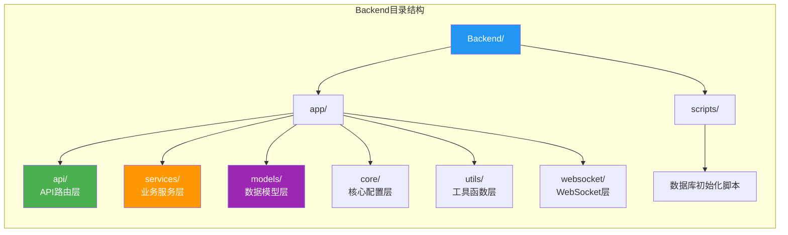

**职责分离原则**：

- API层: 参数验证、路由分发、响应格式化
- Service层: 业务逻辑、数据处理、事务管理
- Model层: 数据结构定义、验证规则
- Utils层: 通用工具、辅助函数

#### 6.5.2 配置管理

**配置文件层次**：

```yaml
1. config.yaml          # 默认配置
2. .env                 # 环境变量（覆盖config.yaml）
3. 代码内默认值         # 兜底配置
```

**配置热更新**（部分支持）：

```python
支持热更新:
- 日志级别
- LLM temperature
- 检索top_k值

需要重启:
- 数据库连接
- 模型路径
- 端口配置
```

#### 6.5.3 依赖管理

**requirements.txt规范**：

```python
格式:
- 固定版本: fastapi==0.104.1
- 最低版本: torch>=2.3.0
- 版本范围: langchain>=0.1.0,<0.2.0

分类:
- 核心依赖（必须）
- 可选依赖（GPU加速）
- 开发依赖（测试、调试）
```

### 6.6 可扩展性设计

#### 6.6.1 模块扩展

**新增嵌入Provider**：

```python
1. 实现AbstractEmbeddingService接口
2. 实现embed_text()方法
3. 注册到provider_map
4. 更新配置文件
```

**新增LLM Provider**：

```python
1. 实现AbstractLLMService接口
2. 实现generate()和stream_generate()
3. 注册到provider_factory
4. 前端UI添加选项
```

#### 6.6.2 功能扩展

**新增Agent工具**：

```python
步骤:
1. 定义工具函数（带docstring）
2. 注册到AgentService.tools
3. 配置工具描述和参数
4. 测试工具调用
```

**新增文档格式**：

```python
步骤:
1. 实现解析函数（返回纯文本）
2. 添加到FileService.parsers
3. 更新allowed_extensions
4. 测试解析功能
```

#### 6.6.3 性能扩展

**水平扩展方案**：

```yaml
方案1: 多实例部署
- Nginx负载均衡
- 共享MySQL、ChromaDB、Neo4j
- 文件系统NFS共享

方案2: 微服务拆分
- 知识库服务独立
- 对话服务独立
- 训练服务独立
- API网关统一入口
```

**垂直扩展方案**：

```yaml
- 增加GPU数量（多卡并行）
- 升级显存（更大模型）
- 增加CPU核心（并发处理）
- 扩展内存（缓存优化）
```

### 6.7 部署方案

#### 6.7.1 Docker部署

**构建镜像**：

```bash
# 构建后端镜像
docker build -t myrag-backend:latest -f Backend/Dockerfile .

# 启动所有服务
docker-compose up -d

# 查看日志
docker-compose logs -f backend
```

**环境变量**：

```env
# .env文件
MYSQL_HOST=myrag-mysql
MYSQL_PORT=3306
MYSQL_USER=myrag
MYSQL_PASSWORD=myrag123
MYSQL_DATABASE=myrag

NEO4J_URI=bolt://myrag-neo4j:7687
NEO4J_USER=neo4j
NEO4J_PASSWORD=myrag123

OLLAMA_BASE_URL=http://myrag-ollama:11434
```

#### 6.7.2 本地部署

**环境准备**：

```bash
# 安装Python依赖
conda create -n MyRAG python=3.11
conda activate MyRAG
pip install -r requirements.txt

# 启动MySQL
# 启动Neo4j
# 启动Ollama（可选）

# 初始化数据库
mysql -u root -p < Backend/scripts/init.sql

# 启动应用
cd Backend
python main.py
```

#### 6.7.3 生产部署建议

**硬件配置**：

```
最低配置:
- CPU: 4核
- 内存: 16GB
- GPU: 6GB显存（RTX 3060）
- 磁盘: 100GB SSD

推荐配置:
- CPU: 8核
- 内存: 32GB
- GPU: 24GB显存（RTX 4090）
- 磁盘: 500GB NVMe SSD
```

**软件版本**：

```
- Ubuntu 22.04 LTS
- Python 3.11+
- MySQL 8.0
- Neo4j 5.15
- Docker 24.0+
- CUDA 12.1+（GPU环境）
```

### 6.8 监控与运维

#### 6.8.1 监控指标

**系统监控**：

- CPU使用率
- 内存使用率
- GPU使用率、显存占用
- 磁盘IO、空间占用
- 网络流量

**应用监控**：

- API响应时间
- 请求成功率
- 并发连接数
- 数据库连接池状态
- 错误日志数量

**业务监控**：

- 知识库数量
- 文件上传数
- 对话次数
- 训练任务状态

#### 6.8.2 告警策略

```yaml
告警规则:
- CPU使用率 > 90% 持续5分钟
- 内存使用率 > 85%
- 磁盘空间 < 10GB
- API错误率 > 5%
- 数据库连接失败
```

#### 6.8.3 备份策略

```yaml
备份内容:
- MySQL数据库: 每日全量 + binlog增量
- Neo4j图数据库: 每周全量
- ChromaDB: 每日增量
- 上传文件: 每日增量
- 模型文件: 手动备份

保留策略:
- 全量备份: 保留30天
- 增量备份: 保留7天
```

---

## 7. 总结

### 7.1 项目特点

MyRAG系统是一个功能完善的企业级RAG知识库管理平台，具有以下特点：

**技术先进性**：
- 采用最新的RAG技术架构
- 支持多种嵌入模型和LLM
- 集成知识图谱增强检索
- 模型量化技术降低硬件门槛

**功能完整性**：
- 8大核心模块覆盖全流程
- 60+个API接口
- 支持多种文档格式
- 完整的训练和部署流程

**架构合理性**：
- 分层清晰、职责明确
- 多数据库混合架构
- 异步IO提升并发
- 微服务化预留扩展空间

**用户友好性**：
- Web界面简洁直观
- 实时进度推送
- 流式响应提升体验
- 详细的错误提示

### 7.2 适用场景

- 企业知识库管理
- 智能客服系统
- 技术文档问答
- 产品咨询助手
- 教育培训平台
- 法律文本检索

### 7.3 后续规划

**功能增强**：
- 多模态支持（图片、音频）
- 更多LLM Provider（OpenAI、Claude）
- 批量文件上传优化
- 文档版本管理

**性能优化**：
- 分布式向量检索
- 模型量化算法优化
- 缓存策略优化
- 查询性能调优

**运维增强**：
- 完善的监控系统
- 自动化运维脚本
- 灾难恢复方案
- 性能压测报告

---

**文档结束**

