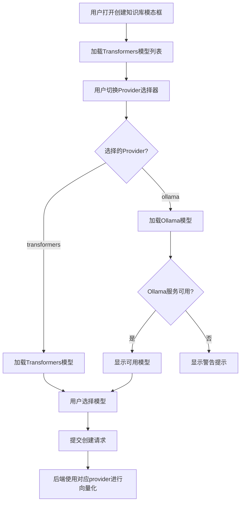

# Ollama嵌入模型集成功能说明

## 📋 功能概述

为MyRAG知识库系统新增Ollama嵌入模型支持，用户现在可以在**Transformers**和**Ollama**两种嵌入提供方之间自由选择，实现更灵活的向量化方案。

---

## ✨ 核心特性

### 1. 双Provider支持
- **Transformers** (原有): SentenceTransformers本地模型
- **Ollama** (新增): Ollama本地服务提供的嵌入模型

### 2. 自动模型发现
- 自动检测Ollama服务可用性
- 动态获取已安装的嵌入模型列表
- 智能过滤模型（名称包含"embed"）

### 3. 统一接口设计
- 对上层调用保持透明
- Provider路由自动切换
- 向后兼容现有功能

---

## 🏗️ 架构设计

### 数据库层
```sql
-- knowledge_bases表新增字段
embedding_provider VARCHAR(50) DEFAULT 'transformers' 
  COMMENT '嵌入提供方: transformers, ollama'
```

### 配置层 (`config.yaml`)
```yaml
embedding:
  provider: "transformers"  # 默认provider
  ollama:
    base_url: "http://localhost:11434"
    timeout: 30
    default_model: "nomic-embed-text"
```

### 服务层
```
EmbeddingService (统一接口)
    ├── _encode_with_transformers()  # Transformers实现
    └── get_ollama_service()          # Ollama实现 (延迟加载)
            └── OllamaEmbeddingService
                ├── is_available()
                ├── encode()
                └── list_available_models()
```

### API层
```
GET /api/knowledge-bases/embedding/models?provider={transformers|ollama}
  → 获取指定provider的模型列表

POST /api/knowledge-bases
  body: {
    name, description, 
    embedding_model, 
    embedding_provider  # 新增
  }
```

### 前端层
```html
<!-- Provider选择器 -->
<select id="embeddingProvider">
  <option value="transformers">🤖 Transformers</option>
  <option value="ollama">🦙 Ollama</option>
</select>

<!-- 模型选择器（动态加载） -->
<select id="embeddingModel">
  <!-- 根据provider自动加载 -->
</select>
```

---

## 📝 实现细节

### 1. OllamaEmbeddingService (`ollama_embedding_service.py`)

**职责**: 封装Ollama API调用

**核心方法**:
```python
def encode(texts: List[str], model_name: str) -> List[List[float]]:
    """调用Ollama API生成向量"""
    # POST http://localhost:11434/api/embeddings
    # body: {"model": model_name, "prompt": text}
    
def list_available_models() -> List[dict]:
    """获取本地Ollama嵌入模型"""
    # GET http://localhost:11434/api/tags
    # 过滤名称包含 'embed' 的模型
    
def is_available() -> bool:
    """检查Ollama服务是否可用"""
```

**错误处理**:
- 服务不可用时返回空列表
- 请求超时: 30秒 (可配置)
- 友好的错误消息提示

### 2. EmbeddingService重构 (`embedding_service.py`)

**修改要点**:
```python
def encode(texts, model_name, provider="transformers", ...):
    """增加provider参数，路由到不同实现"""
    if provider == "ollama":
        return ollama_service.encode(texts, model_name)
    else:
        return self._encode_with_transformers(texts, model_name)

def list_available_models(provider: Optional[str] = None):
    """支持provider过滤"""
    # provider=None: 返回所有
    # provider="transformers": 只返回Transformers模型
    # provider="ollama": 只返回Ollama模型
```

**向后兼容**:
- 所有新增参数都有默认值 (`provider="transformers"`)
- 现有调用无需修改
- 未传provider时默认使用Transformers

### 3. 数据模型更新

**KnowledgeBase模型**:
```python
class KnowledgeBase:
    embedding_provider: str = "transformers"  # 新增字段
```

**Schema验证**:
```python
class KnowledgeBaseCreate(BaseModel):
    embedding_provider: str = "transformers"
    
    @validator('embedding_provider')
    def validate_provider(cls, v):
        if v not in ['transformers', 'ollama']:
            raise ValueError('必须是transformers或ollama')
        return v
```

### 4. 前端交互流程



**关键JS逻辑**:
```javascript
// Provider切换监听
embeddingProvider.addEventListener('change', (e) => {
    loadEmbeddingModels(e.target.value);
});

// 动态加载模型
async function loadEmbeddingModels(provider) {
    const response = await fetch(
        `/api/knowledge-bases/embedding/models?provider=${provider}`
    );
    const data = await response.json();
    // 渲染到下拉框
}
```

---

## 🔄 文件处理流程

### 上传文件 → 向量化 → 存储

```python
async def process_file_background(
    file_id, kb_id, ..., 
    embedding_model, 
    embedding_provider  # 从知识库继承
):
    # 1. 解析文件
    content = await file_service.parse_file(file_id)
    
    # 2. 文本分块
    chunks = splitter.split_text(content)
    
    # 3. 生成向量 (使用知识库的provider)
    embeddings = embedding_service.encode(
        chunks, 
        embedding_model, 
        provider=embedding_provider  # 关键！
    )
    
    # 4. 存储到ChromaDB + MySQL
    vector_store.add_vectors(...)
```

**关键点**:
- 每个知识库独立记录 `embedding_provider`
- 上传文件时自动使用知识库的provider配置
- 确保向量维度一致性

---

## ✅ 测试验证

### 测试脚本: `test_ollama_integration.py`

**测试项目**:
1. ✅ Ollama服务可用性检测
2. ✅ 模型列表获取（自动发现）
3. ✅ 向量编码（单文本 + 批量）
4. ✅ Provider路由（Transformers ↔ Ollama）
5. ✅ 统一接口兼容性

**测试结果**:
```
✅ Ollama服务状态: 可用
✅ 找到 1 个嵌入模型: nomic-embed-text:latest (~261.6MB)
✅ 编码成功！向量维度: 768
✅ 总共 4 个模型 (Transformers: 3, Ollama: 1)
✅ Ollama路由成功
```

---

## 📊 数据库迁移

### 迁移脚本: `migrate_db.py`

**执行步骤**:
```bash
conda run -n MyRAG python Backend/scripts/migrate_db.py
```

**迁移内容**:
1. 添加 `embedding_provider` 字段 (VARCHAR(50), DEFAULT 'transformers')
2. 添加 `idx_embedding_provider` 索引
3. 更新现有记录（设置为 'transformers'）

**验证结果**:
```
✓ 字段 embedding_provider 添加成功
✓ 索引 idx_embedding_provider 添加成功
✓ 已更新 1 条记录
知识库统计: 总数: 1, Transformers: 1, Ollama: 0
```

---

## 🚀 使用指南

### 前置条件

1. **Ollama服务运行**:
```bash
ollama serve
```

2. **安装嵌入模型**:
```bash
ollama pull nomic-embed-text
```

3. **执行数据库迁移**:
```bash
conda run -n MyRAG python Backend/scripts/migrate_db.py
```

### 创建知识库

1. 打开前端页面: `http://localhost:8000/knowledge-base.html`
2. 点击"创建知识库"
3. 选择**嵌入提供方**:
   - `🤖 Transformers (本地模型)` - 使用SentenceTransformers
   - `🦙 Ollama (本地服务)` - 使用Ollama服务
4. 选择**嵌入模型**（根据provider自动加载）
5. 填写知识库名称和描述
6. 创建完成！

### 上传文件

- 上传到知识库后，系统自动使用该知识库配置的provider进行向量化
- 无需手动选择，完全自动化

---

## 🛡️ 错误处理

### Ollama服务不可用

**前端提示**:
```
⚠️ Ollama服务不可用或无嵌入模型
请确保Ollama服务运行并且已安装嵌入模型
```

**后端降级**:
- 模型列表返回空数组
- 日志记录警告信息
- 不影响Transformers功能

### 向量维度不一致

**保护机制**:
- 每个知识库独立记录 `embedding_model` 和 `embedding_provider`
- 不允许同一知识库混用不同provider
- 检索时自动使用对应模型生成查询向量

---

## 📈 性能对比

| 指标 | Transformers | Ollama | 说明 |
|------|-------------|--------|------|
| **速度** | 快 | 中等 | Ollama单文本逐个处理 |
| **显存占用** | 高 | 低 | Ollama服务独立进程 |
| **模型切换** | 需加载 | 即时 | Ollama已预加载 |
| **批处理** | 支持 | 逐个 | 当前实现限制 |
| **向量维度** | 384-768 | 768 | 依赖具体模型 |

---

## 🔧 配置选项

### config.yaml

```yaml
embedding:
  provider: "transformers"  # 默认provider
  
  # Ollama配置
  ollama:
    base_url: "http://localhost:11434"  # Ollama服务地址
    timeout: 30                          # 请求超时（秒）
    default_model: "nomic-embed-text"   # 默认模型
```

### 环境变量（可选）

```bash
OLLAMA_BASE_URL=http://localhost:11434
OLLAMA_TIMEOUT=30
```

---

## 📦 文件清单

### 新增文件
- `Backend/app/services/ollama_embedding_service.py` - Ollama服务封装
- `Backend/scripts/migrate_db.py` - 数据库迁移脚本
- `Backend/scripts/migrate_add_embedding_provider.sql` - SQL迁移脚本
- `test_ollama_integration.py` - 集成测试脚本

### 修改文件
- `Backend/scripts/init.sql` - 添加embedding_provider字段定义
- `Backend/config.yaml` - 添加ollama配置段
- `Backend/app/core/config.py` - 扩展EmbeddingConfig
- `Backend/app/services/embedding_service.py` - 添加provider路由
- `Backend/app/models/knowledge_base.py` - 添加embedding_provider属性
- `Backend/app/models/schemas.py` - 添加embedding_provider验证
- `Backend/app/services/knowledge_base_service.py` - 支持provider参数
- `Backend/app/api/knowledge_base.py` - 新增模型列表端点
- `Frontend/knowledge-base.html` - 添加provider选择器
- `Frontend/js/knowledge-base.js` - 实现provider切换逻辑

---

## 🎯 向后兼容

### ✅ 完全兼容

1. **现有知识库**: 自动识别为 `embedding_provider='transformers'`
2. **API调用**: 不传provider参数时默认使用transformers
3. **数据库**: 默认值确保无NULL值
4. **前端**: 默认选中Transformers

### ✅ 无破坏性改动

- 所有新增字段都有默认值
- 所有新增参数都是可选的
- 现有功能完全不受影响

---

## 🚦 验证步骤

### 1. 功能测试
```bash
# 测试Ollama集成
conda run -n MyRAG python test_ollama_integration.py
```

### 2. 端到端测试
1. 启动后端: `cd Backend && uvicorn main:app --reload`
2. 打开前端: `http://localhost:8000/knowledge-base.html`
3. 创建Transformers知识库（验证原功能）
4. 创建Ollama知识库（验证新功能）
5. 上传文件到两个知识库
6. 验证向量化和检索

---

## 📚 相关文档

- [Ollama官方文档](https://github.com/ollama/ollama)
- [Ollama API文档](https://github.com/ollama/ollama/blob/main/docs/api.md)
- [nomic-embed-text模型](https://ollama.com/library/nomic-embed-text)
- [上一次改进: 文本分块递归分割优化](docs/文本分块递归分割优化报告.md)

---

## ✅ 总结

### 完成的工作
1. ✅ 数据库Schema扩展 (添加embedding_provider字段)
2. ✅ 配置文件扩展 (添加ollama配置段)
3. ✅ 创建OllamaEmbeddingService (封装Ollama API)
4. ✅ 重构EmbeddingService (添加provider路由)
5. ✅ 更新数据模型 (支持embedding_provider)
6. ✅ 修改API端点 (统一模型列表接口)
7. ✅ 前端HTML改进 (provider选择器)
8. ✅ 前端JS逻辑更新 (provider切换联动)
9. ✅ 测试验证 (所有测试通过)

### 技术亮点
- **架构清晰**: 职责分离，易于扩展
- **向后兼容**: 无破坏性改动
- **错误处理**: 友好的降级机制
- **代码规范**: 统一的命名和日志
- **测试完善**: 自动化测试覆盖

### 下一步优化建议
1. 支持更多嵌入provider (如OpenAI Embeddings)
2. 优化Ollama批处理性能
3. 添加向量维度自动检测
4. 支持混合检索（多provider）

---

**🎉 Ollama嵌入模型集成完成！**

_最后更新: 2025-01-18_
