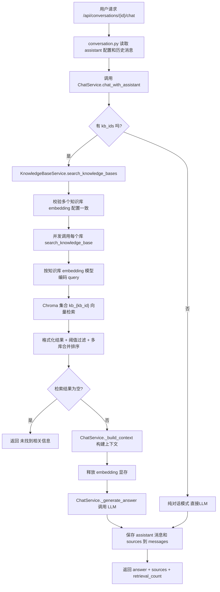
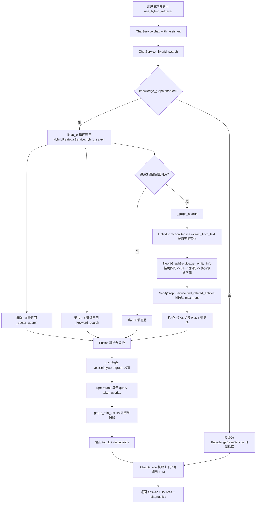
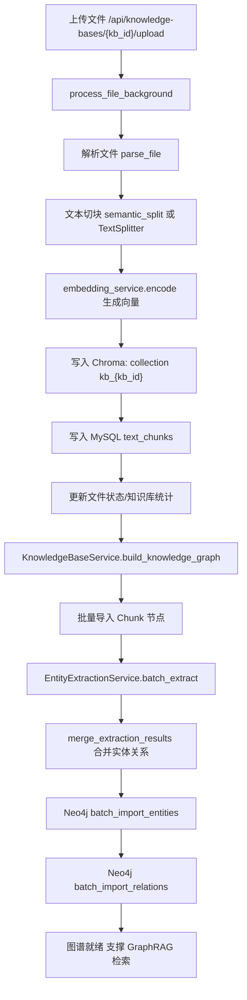

# MyRAG 项目中传统 RAG 与 GraphRAG 流程梳理

本文基于当前代码实现整理两条问答路线：
- 传统 RAG（纯向量检索）
- GraphRAG（混合检索：向量 + 关键词 + 图谱）

## 1. 传统 RAG 路线（Vector RAG）

主要入口：
- 对话入口：`/api/conversations/{conversation_id}/chat`
- 关键开关：`use_hybrid_retrieval = false`

## 2. GraphRAG 路线（Hybrid Retrieval）

主要入口：
- 对话入口：`/api/conversations/{conversation_id}/chat` 或 `/chat/stream`
- 关键开关：`use_hybrid_retrieval = true`
- 关键前提：图谱能力开启且 Neo4j 可用

## 3. GraphRAG 的图谱构建（离线/入库阶段）

GraphRAG 检索依赖上传时构建的图谱，流程在文件上传后台任务中完成。

## 4. 两条路线的核心差异总结

- 召回通道：传统 RAG 仅向量；GraphRAG 为向量 + 关键词 + 图谱三通道。
- 依赖数据：传统 RAG 依赖 Chroma 向量库；GraphRAG 额外依赖 Neo4j 图谱和实体关系。
- 融合策略：GraphRAG 使用 RRF + 轻量重排 + 图结果保底，并输出 diagnostics。
- 兜底机制：GraphRAG 在图谱关闭/异常时自动回退到纯向量检索。

## 5. 关键代码定位

- 对话入口与开关：`Backend/app/api/conversation.py`
- 文件上传与图谱构建触发：`Backend/app/api/knowledge_base.py`
- 传统 RAG 检索：`Backend/app/services/knowledge_base_service.py`
- 混合检索主流程：`Backend/app/services/hybrid_retrieval_service.py`
- 图数据库与图遍历：`Backend/app/services/neo4j_graph_service.py`
- 对话编排与 LLM 生成：`Backend/app/services/chat_service.py`
