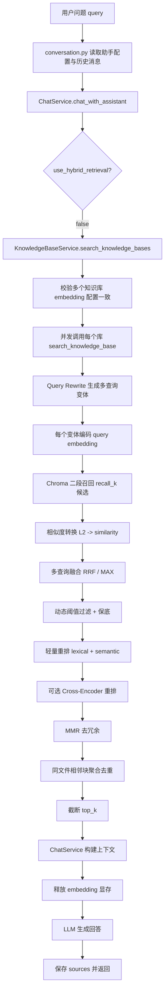

# MyRAG 传统 RAG 路线完整梳理（主流程 + 技术细节）

本文基于当前代码实现梳理传统 RAG（纯向量检索）路线，覆盖：
- API 到服务层主流程
- 召回、融合、阈值、重排、去重技术细节
- 配置项说明
- 监控与排障建议

## 1. 入口与调用链

### 1.1 对话入口
- 同步对话入口：`POST /api/conversations/{conversation_id}/chat`
- 路由文件：`Backend/app/api/conversation.py`

核心流程：
1. 读取会话与助手配置（`kb_ids`、`llm_model`、`system_prompt` 等）
2. 拉取历史消息并保存当前用户消息
3. 调用 `ChatService.chat_with_assistant()`
4. 保存 AI 回复和来源 `sources`
5. 返回回答、来源、检索统计

### 1.2 传统 RAG 分支判断
- 在 `ChatService.chat_with_assistant()` 中：
  - `use_hybrid_retrieval = false` 时进入传统向量检索
  - 调用 `KnowledgeBaseService.search_knowledge_bases(...)`
- 服务文件：`Backend/app/services/chat_service.py`

## 2. 传统 RAG 主流程（当前实现）

## 3. 检索阶段技术细节

实现文件：`Backend/app/services/knowledge_base_service.py`

### 3.1 多知识库并发与一致性校验
- 先检查所有 `kb_ids` 使用同一 `(embedding_provider, embedding_model)`。
- 不一致则直接报错，避免跨向量空间混检带来错误排序。

### 3.2 二段召回（Two-Stage Recall）
- 不再只拿 `top_k`，而是先取候选池 `recall_k`：
  - `recall_k = clamp(top_k * recall_factor, min_recall_k, max_recall_k)`
- 目的：给后续阈值与重排留足空间。

### 3.3 Query Rewrite（查询改写）
- 对原始 query 生成多个变体（可配置）：
  - 原 query
  - 归一化 query（NFKC + 空白规范）
  - 关键词 query（去停用词）
  - 意图扩展 query（例如追加“定义/作用/场景”）
- 每个变体独立召回候选。

### 3.4 多查询融合（Multi-Query Fusion）
- 支持两种融合：
  - `rrf`（Reciprocal Rank Fusion）
  - `max`（取最大相似度）
- 默认 `rrf`，更稳健。

### 3.5 相似度计算
- Chroma 返回 L2 距离，使用：
  - $similarity = 1 - \frac{distance^2}{2}$
- 代码位置：`Backend/app/utils/similarity.py`。

### 3.6 动态阈值 + 保底
- 阈值策略：
  - 显式阈值优先
  - 否则使用 `base_score_threshold`
  - 动态阈值：`max(base_threshold, top1 - relative_margin)`
- 若过滤后过少，使用 `min_keep_results` 兜底。

## 4. 重排与去重阶段技术细节

### 4.1 轻量重排（Light Rerank）
- 融合两类信号：
  - 语义分（向量相似度）
  - 词法分（token overlap + 文件名命中 bonus）
- 融合公式：
  - $score = \alpha \cdot semantic + (1-\alpha) \cdot lexical$

### 4.2 可选 Cross-Encoder 重排
- 开关开启时，对前 `cross_encoder_top_n` 个候选进行重打分。
- 当前实现是懒加载模型，失败自动回退到轻量重排，不中断主流程。

### 4.3 MMR 去冗余
- 基于候选向量执行 MMR，平衡相关性与多样性。
- 依赖从 Chroma 查询返回 `embeddings`（当前已支持 `include` 参数）。

### 4.4 同文件聚合去重
- 按 `file_id + chunk_index` 相邻窗口聚类。
- 合并相邻块内容，写入 `metadata.evidence_chunks`。
- 控制每簇最大块数、每文件最大簇数，降低重复上下文占比。

## 5. 生成阶段技术细节

实现文件：`Backend/app/services/chat_service.py`

1. `_build_context()` 将检索结果格式化为可读上下文
2. `search_results` 存在时释放 embedding 显存，给 LLM 腾空间
3. `_generate_answer()` 调用 LLM（transformers / ollama / LoRA）
4. 返回 `answer + sources + retrieval_count`

## 6. 配置总览（传统 RAG）

配置文件：`Backend/config.yaml`
配置模型：`Backend/app/core/config.py` -> `VectorRetrievalConfig`

### 6.1 核心配置块
- `vector_retrieval.enable_two_stage`
- `vector_retrieval.recall_factor`
- `vector_retrieval.min_recall_k`
- `vector_retrieval.max_recall_k`
- `vector_retrieval.enable_dynamic_threshold`
- `vector_retrieval.base_score_threshold`
- `vector_retrieval.relative_margin`
- `vector_retrieval.min_keep_results`
- `vector_retrieval.enable_light_rerank`
- `vector_retrieval.rerank_alpha`
- `vector_retrieval.enable_mmr`
- `vector_retrieval.mmr_lambda`
- `vector_retrieval.enable_cluster_dedup`
- `vector_retrieval.cluster_adjacent_window`
- `vector_retrieval.max_chunks_per_cluster`
- `vector_retrieval.max_clusters_per_file`
- `vector_retrieval.enable_query_rewrite`
- `vector_retrieval.query_rewrite_max_variants`
- `vector_retrieval.enable_multi_query_fusion`
- `vector_retrieval.fusion_method`
- `vector_retrieval.rrf_k`
- `vector_retrieval.enable_cross_encoder_rerank`
- `vector_retrieval.cross_encoder_model`
- `vector_retrieval.cross_encoder_top_n`
- `vector_retrieval.cross_encoder_alpha`
- `vector_retrieval.monitoring_enabled`
- `vector_retrieval.metrics_log_file`

## 7. 监控与可观测性

已实现检索指标落盘（JSONL）：
- 文件：`data/logs/retrieval_metrics.jsonl`
- 典型字段：
  - `query` / `query_variants`
  - `top_k` / `recall_k`
  - `candidate_count` / `returned_count`
  - `effective_threshold`
  - `after_threshold` / `after_rerank`
  - `elapsed_ms`

建议长期关注：
1. 空召回率（returned_count=0 占比）
2. 候选压缩率（candidate_count -> returned_count）
3. 95 分位检索耗时
4. 不同知识库的阈值分布差异

## 8. 失败与降级行为

1. 多知识库 embedding 配置不一致：抛错阻断
2. Cross-Encoder 加载或推理失败：自动回退轻量重排
3. 查询向量生成失败（全局重排阶段）：跳过 MMR，继续执行
4. 指标写盘失败：仅 warning，不影响主流程

## 9. 与 Hybrid 路线的边界

- 本文仅描述传统 RAG：`use_hybrid_retrieval = false`
- Hybrid 路线额外包含关键词通道与图谱通道（Neo4j）
- 两条路线共享对话编排与 LLM 生成逻辑，但检索与重排链路不同

## 10. 快速定位代码

- 对话入口：`Backend/app/api/conversation.py`
- 对话编排：`Backend/app/services/chat_service.py`
- 传统检索主逻辑：`Backend/app/services/knowledge_base_service.py`
- 向量库查询：`Backend/app/services/vector_store_service.py`
- 相似度转换：`Backend/app/utils/similarity.py`
- 配置定义：`Backend/app/core/config.py`
- 配置实例：`Backend/config.yaml`
