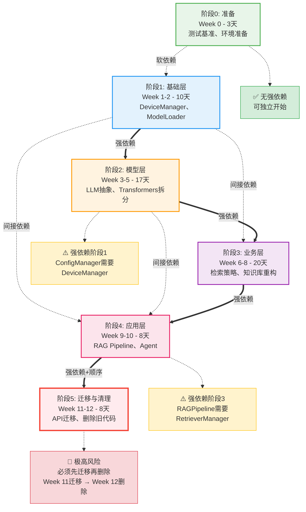
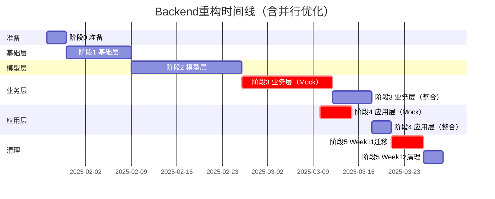
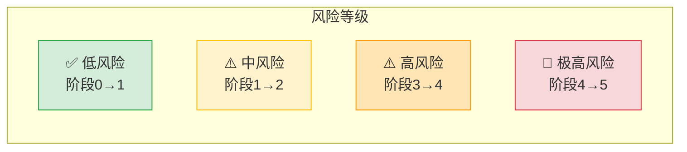
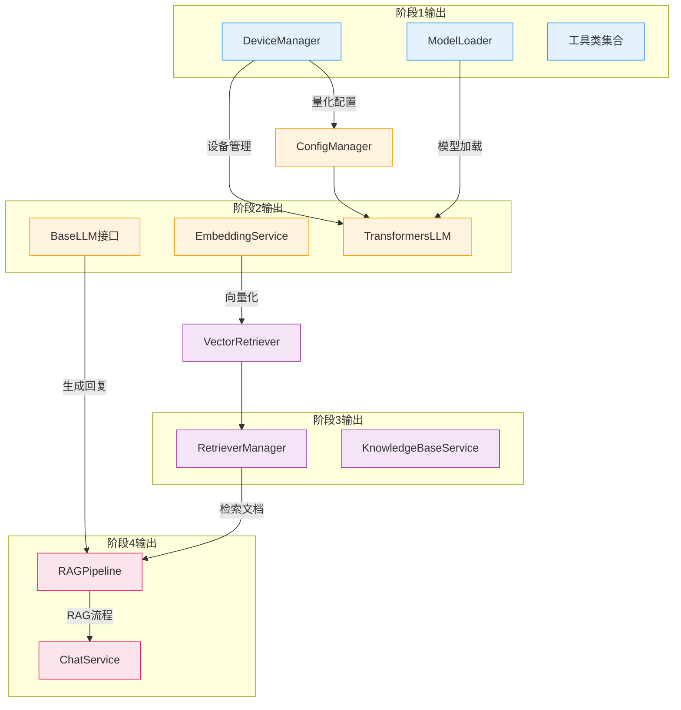

# Backend重构依赖关系可视化图




## 依赖关系详细说明

### 图例说明

- **实线箭头（==强依赖==>）**: 必须等待前置阶段完成，无法并行
- **虚线箭头（-.间接依赖.->）**: 通过中间层间接依赖，可部分并行
- **点线箭头（-.软依赖.->）**: 可选依赖，不阻塞开发

### 关键路径（Critical Path）

```
阶段0 → 阶段1 → 阶段2 → 阶段3 → 阶段4 → 阶段5
  3天     10天     17天     20天     8天     8天

总计: 66天（约13周）
```

### 并行开发机会



### 风险热力图



## 依赖矩阵（行依赖列）

|        | 阶段0 | 阶段1 | 阶段2 | 阶段3 | 阶段4 | 阶段5 |
|--------|-------|-------|-------|-------|-------|-------|
| 阶段0  | -     | ❌    | ❌    | ❌    | ❌    | ❌    |
| 阶段1  | ✅    | -     | ❌    | ❌    | ❌    | ❌    |
| 阶段2  | ❌    | ✅    | -     | ❌    | ❌    | ❌    |
| 阶段3  | ❌    | ✅    | ✅    | -     | ❌    | ❌    |
| 阶段4  | ❌    | ✅    | ✅    | ✅    | -     | ❌    |
| 阶段5  | ❌    | ✅    | ✅    | ✅    | ✅    | -     |

**✅ = 有依赖 | ❌ = 无依赖 | - = 自身**

**结论**: ✅ **无循环依赖**，依赖关系为单向流（DAG有向无环图）

## 核心组件依赖图



## 关键检查点

### 🔍 阶段1完成前
- [ ] DeviceManager接口完整性测试
- [ ] ModelLoader单元测试覆盖率>80%
- [ ] Mock对象提供（给阶段2使用）

### 🔍 阶段2完成前
- [ ] BaseLLM接口冻结
- [ ] EmbeddingService统一接口测试
- [ ] Mock EmbeddingService提供

### 🔍 阶段3完成前
- [ ] RetrieverManager性能测试（QPS>100）
- [ ] 检索接口冻结
- [ ] Mock RetrieverManager提供

### 🔍 阶段4完成前
- [ ] RAGPipeline集成测试通过
- [ ] 所有API端点测试通过

### 🔴 阶段5完成前（极高风险）
- [ ] ✅ Week 11迁移任务全部完成
- [ ] ✅ 全局搜索确认无旧服务引用
- [ ] ✅ 创建回滚点（Git tag）
- [ ] Week 12才能执行删除操作

---

**图表维护**: 如有架构调整，请同步更新此文档和`依赖关系分析报告.md`
