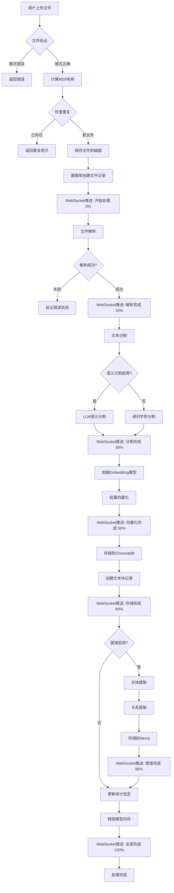
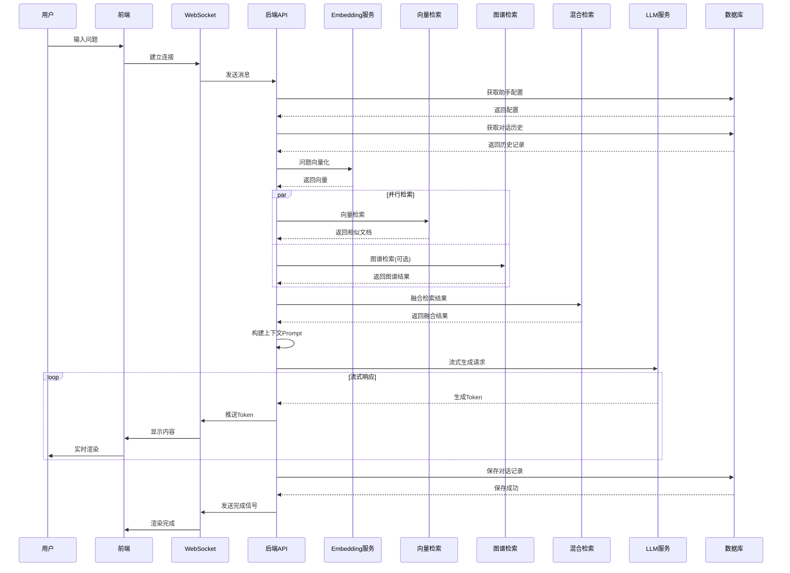
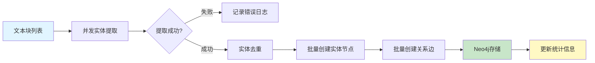
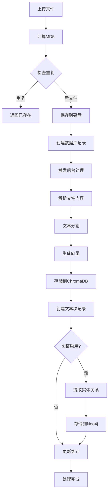

# MyRAG 项目总结文档

**项目名称**: MyRAG - RAG 知识库管理系统  
**创建日期**: 2025年11月20日  
**技术负责人**: yuluochengwen  
**项目状态**: 生产环境运行中

---

## 📋 目录

1. [项目概述](#项目概述)
2. [核心功能](#核心功能)
3. [技术架构](#技术架构)
4. [系统架构](#系统架构)
5. [项目结构](#项目结构)
6. [技术栈详解](#技术栈详解)
7. [数据库设计](#数据库设计)
8. [部署方案](#部署方案)
9. [核心模块说明](#核心模块说明)
10. [扩展功能](#扩展功能)

---

## 1. 项目概述

MyRAG 是一个基于 FastAPI + MySQL + ChromaDB 的企业级 RAG（Retrieval-Augmented Generation）知识库管理系统。该系统集成了知识管理、智能检索、AI对话、知识图谱和LoRA模型微调等多项功能，为用户提供完整的知识管理和智能问答解决方案。

### 1.1 项目定位

- **企业级知识库管理平台**：支持多种文档格式上传、智能解析和向量化存储
- **RAG 增强对话系统**：结合检索增强生成技术，提供准确的知识问答
- **模型微调平台**：集成 LLaMA-Factory 和简易 LoRA 训练，支持模型定制化
- **知识图谱构建**：自动提取实体关系，构建知识网络

### 1.2 核心特性

✅ **多模型支持**
- 本地模型（Transformers）
- Ollama 本地/云端模型
- 支持多种嵌入模型（Sentence Transformers, Ollama Embeddings）

✅ **智能文档处理**
- 支持格式：TXT, PDF, DOCX, HTML, Markdown
- 递归文本分割 + 语义分割
- 自动向量化和索引

✅ **混合检索策略**
- 向量检索（ChromaDB）
- 知识图谱检索（Neo4j）
- 可配置权重的混合检索

✅ **完整的对话系统**
- 上下文记忆管理
- 流式响应
- WebSocket 实时通信

✅ **LoRA 微调能力**
- 集成 LLaMA-Factory（完整训练流程）
- 简易训练（快速上手）
- 模型管理和部署

---

## 2. 核心功能

### 2.1 知识库管理

**功能列表**：
- 创建/删除/更新知识库
- 文件上传（单个/批量）
- 文件解析和文本提取
- 文本智能分块（递归/语义）
- 向量化和存储
- 知识图谱自动构建
- 文件去重检测（基于 MD5）

**支持的文件类型**：
```
- TXT: 纯文本文件
- PDF: PDF 文档（PyPDF2）
- DOCX: Word 文档（python-docx）
- HTML: 网页文件（BeautifulSoup）
- Markdown: MD 文档
- JSON: 结构化数据
```

**文本处理配置**：
```yaml
chunk_size: 800           # 文本块大小
chunk_overlap: 100        # 重叠大小
semantic_split: true      # 启用语义分割
```

### 2.2 智能助手系统

**助手配置**：
- 关联多个知识库（支持相同 embedding_model）
- 选择 LLM 模型（Transformers/Ollama）
- 自定义系统提示词
- 配色主题选择（5种主题）

**对话功能**：
- RAG 增强对话（检索+生成）
- 上下文记忆（最近 N 轮对话）
- 流式响应（实时打字效果）
- Markdown 渲染
- 对话历史管理

**检索策略**：
- 纯向量检索
- 混合检索（向量 + 图谱）
- 可调节检索结果数量（top_k）

### 2.3 知识图谱

**自动构建**：
- 实体提取（Ollama LLM）
- 关系提取
- 增量构建（不覆盖已有数据）

**实体类型**：
```
- Person（人物）
- Organization（组织）
- Location（地点）
- Product（产品）
- Concept（概念）
- Event（事件）
- Date（日期）
```

**图谱功能**：
- 实体统计
- 关系统计
- 图遍历查询
- 可视化展示

### 2.4 模型管理

**本地模型管理**：
- LLM 模型扫描（Models/LLM/）
- Embedding 模型扫描（Models/Embedding/）
- LoRA 模型扫描（Models/LoRA/）
- 模型大小统计

**Ollama 模型管理**：
- 可用模型列表
- LLM 模型检测
- Embedding 模型检测
- 模型类型推断

### 2.5 LoRA 微调

**简易训练**：
- 基于 PEFT 框架
- 4-bit 量化（QLoRA）
- Alpaca/ShareGPT 格式支持
- 实时进度追踪

**LLaMA-Factory 集成**：
- 完整的训练流程
- Web UI 界面
- 多种训练方法（LoRA, QLoRA, Full）
- 模型评估和导出

---

## 3. 技术架构

### 3.1 整体架构图

```
┌─────────────────────────────────────────────────────────┐
│                       前端层 (Frontend)                    │
│  HTML5 + Tailwind CSS + Vanilla JavaScript               │
│  - 知识库管理页面                                          │
│  - 智能助手页面                                           │
│  - 模型管理页面                                           │
│  - LoRA训练页面                                          │
└────────────────────┬────────────────────────────────────┘
                     │ HTTP/WebSocket
┌────────────────────▼────────────────────────────────────┐
│                    Nginx 反向代理                         │
│  - 静态文件服务                                           │
│  - API 路由转发                                          │
│  - WebSocket 支持                                        │
└────────────────────┬────────────────────────────────────┘
                     │
┌────────────────────▼────────────────────────────────────┐
│                  后端层 (FastAPI)                         │
│  ┌──────────────────────────────────────────────┐       │
│  │  API 路由层                                   │       │
│  │  - 知识库 API                                 │       │
│  │  - 助手 API                                  │       │
│  │  - 模型 API                                  │       │
│  │  - LoRA API                                 │       │
│  │  - WebSocket API                            │       │
│  └──────────────────────────────────────────────┘       │
│  ┌──────────────────────────────────────────────┐       │
│  │  业务逻辑层 (Services)                        │       │
│  │  - KnowledgeBaseService                     │       │
│  │  - ChatService                              │       │
│  │  - EmbeddingService                         │       │
│  │  - VectorStoreService                       │       │
│  │  - Neo4jGraphService                        │       │
│  │  - HybridRetrievalService                   │       │
│  │  - FileService                              │       │
│  │  - ModelManager                             │       │
│  │  - SimpleLoRATrainer                        │       │
│  └──────────────────────────────────────────────┘       │
│  ┌──────────────────────────────────────────────┐       │
│  │  工具层 (Utils)                               │       │
│  │  - FileParser (文档解析)                      │       │
│  │  - TextSplitter (文本分割)                    │       │
│  │  - Validators (验证器)                        │       │
│  │  - Logger (日志)                              │       │
│  └──────────────────────────────────────────────┘       │
└────────────────────┬────────────────────────────────────┘
                     │
        ┌────────────┴────────────┐
        │                         │
┌───────▼────────┐       ┌───────▼──────────┐
│   数据存储层    │       │   外部服务层       │
├────────────────┤       ├──────────────────┤
│ MySQL 8.0      │       │ Ollama           │
│ - 知识库表     │       │ - LLM 服务       │
│ - 文件表       │       │ - Embedding      │
│ - 助手表       │       └──────────────────┘
│ - 对话表       │       ┌──────────────────┐
│ - 训练任务表   │       │ LLaMA-Factory    │
├────────────────┤       │ - 模型训练       │
│ ChromaDB       │       │ - Web UI         │
│ - 向量存储     │       └──────────────────┘
├────────────────┤
│ Neo4j 5.15     │
│ - 知识图谱     │
└────────────────┘
```

### 3.2 数据流图

**文件上传流程**：
```
用户上传文件 
  → 文件验证（大小/格式）
  → 文件哈希计算（去重）
  → 文件存储（KnowledgeBase/kb_id/）
  → 文件解析（提取文本）
  → 文本分割（递归/语义）
  → 向量化（Embedding）
  → 向量存储（ChromaDB）
  → 图谱构建（实体提取+关系）
  → 数据库更新（统计信息）
  → WebSocket推送（进度通知）
```

**RAG 对话流程**：
```
用户提问 
  → 问题向量化
  → 向量检索（ChromaDB top_k）
  → 图谱检索（Neo4j，可选）
  → 结果融合（混合检索）
  → 构建 Prompt（上下文+历史）
  → LLM 生成（流式）
  → 响应返回（WebSocket/HTTP）
  → 对话历史保存
```

---

## 4. 系统架构

### 4.1 分层架构设计

```
╔══════════════════════════════════════════════════════════╗
║                    表现层 (Presentation)                   ║
╠══════════════════════════════════════════════════════════╣
║  前端页面                                                  ║
║  ┌────────────┬────────────┬────────────┬──────────────┐ ║
║  │知识库管理  │ 智能助手   │ 模型管理   │  LoRA训练    │ ║
║  └────────────┴────────────┴────────────┴──────────────┘ ║
║  JavaScript + Tailwind CSS + WebSocket Client            ║
╚══════════════════════════════════════════════════════════╝
                            ↕
╔══════════════════════════════════════════════════════════╗
║                    接口层 (API Gateway)                    ║
╠══════════════════════════════════════════════════════════╣
║  Nginx 反向代理                                            ║
║  - 静态资源服务 (/)                                        ║
║  - API 路由转发 (/api/*)                                  ║
║  - WebSocket 代理 (/ws/*)                                ║
╚══════════════════════════════════════════════════════════╝
                            ↕
╔══════════════════════════════════════════════════════════╗
║                  应用层 (Application)                      ║
╠══════════════════════════════════════════════════════════╣
║  FastAPI 后端应用                                          ║
║  ┌──────────────────────────────────────────────────┐   ║
║  │ 路由层 (Routers)                                  │   ║
║  │ - KnowledgeBase Router  - Assistant Router       │   ║
║  │ - WebSocket Router      - Models Router          │   ║
║  │ - LoRA Training Router  - Conversation Router    │   ║
║  └──────────────────────────────────────────────────┘   ║
║  ┌──────────────────────────────────────────────────┐   ║
║  │ 中间件 (Middleware)                               │   ║
║  │ - CORS 跨域处理   - 异常处理   - 日志记录        │   ║
║  └──────────────────────────────────────────────────┘   ║
╚══════════════════════════════════════════════════════════╝
                            ↕
╔══════════════════════════════════════════════════════════╗
║                  业务逻辑层 (Business Logic)               ║
╠══════════════════════════════════════════════════════════╣
║  核心服务 (Core Services)                                 ║
║  ┌────────────────────┬────────────────────┐            ║
║  │ 知识库服务         │ 对话服务           │            ║
║  │ - 创建/删除/查询   │ - RAG 对话        │            ║
║  │ - 文件管理         │ - 历史管理        │            ║
║  │ - 统计信息         │ - 流式响应        │            ║
║  └────────────────────┴────────────────────┘            ║
║  ┌────────────────────┬────────────────────┐            ║
║  │ 检索服务           │ 图谱服务           │            ║
║  │ - 向量检索         │ - 实体提取        │            ║
║  │ - 混合检索         │ - 关系构建        │            ║
║  │ - 相似度计算       │ - 图遍历查询      │            ║
║  └────────────────────┴────────────────────┘            ║
║  ┌────────────────────┬────────────────────┐            ║
║  │ 模型服务           │ 训练服务           │            ║
║  │ - Embedding 模型   │ - LoRA 训练       │            ║
║  │ - LLM 模型         │ - 任务管理        │            ║
║  │ - Ollama 集成      │ - 进度追踪        │            ║
║  └────────────────────┴────────────────────┘            ║
╚══════════════════════════════════════════════════════════╝
                            ↕
╔══════════════════════════════════════════════════════════╗
║                   数据访问层 (Data Access)                 ║
╠══════════════════════════════════════════════════════════╣
║  ┌──────────────┬──────────────┬──────────────────┐     ║
║  │ MySQL DAO    │ ChromaDB API │ Neo4j Driver     │     ║
║  │ - 连接池管理 │ - 向量操作   │ - 图查询         │     ║
║  │ - 事务管理   │ - 集合管理   │ - 批量写入       │     ║
║  └──────────────┴──────────────┴──────────────────┘     ║
╚══════════════════════════════════════════════════════════╝
                            ↕
╔══════════════════════════════════════════════════════════╗
║                   数据持久层 (Persistence)                 ║
╠══════════════════════════════════════════════════════════╣
║  ┌──────────────┬──────────────┬──────────────────┐     ║
║  │ MySQL 8.0    │ ChromaDB     │ Neo4j 5.15       │     ║
║  │ - 关系数据   │ - 向量数据   │ - 图数据         │     ║
║  └──────────────┴──────────────┴──────────────────┘     ║
║  ┌──────────────────────────────────────────────────┐   ║
║  │ 文件系统存储                                      │   ║
║  │ - KnowledgeBase/ (文档文件)                      │   ║
║  │ - Models/ (AI模型)                               │   ║
║  │ - VectorDB/ (向量DB持久化)                       │   ║
║  └──────────────────────────────────────────────────┘   ║
╚══════════════════════════════════════════════════════════╝
```

### 4.2 微服务交互图

```
┌─────────────────────────────────────────────────────────┐
│                    客户端浏览器                          │
└────────┬────────────────────────────────────────────────┘
         │ HTTPS/WSS
         ↓
┌────────────────────────────────────────────────────────┐
│                   Nginx (Port 80)                       │
│  ┌─────────────────────────────────────────────────┐   │
│  │  静态文件服务        API代理        WS代理       │   │
│  │  Frontend/      →  Backend:8000  →  Backend     │   │
│  └─────────────────────────────────────────────────┘   │
└────────┬───────────────────────────────────────────────┘
         │
         ↓
┌────────────────────────────────────────────────────────┐
│            FastAPI Backend (Port 8000)                  │
│  ┌──────────────────────────────────────────────────┐  │
│  │  API Endpoints                                    │  │
│  │  /api/knowledge-bases  /api/assistants           │  │
│  │  /api/models          /api/simple-lora           │  │
│  │  /ws                  /api/conversations         │  │
│  └──────────────────────────────────────────────────┘  │
└────┬────────┬─────────┬─────────┬────────────┬─────────┘
     │        │         │         │            │
     ↓        ↓         ↓         ↓            ↓
┌─────────┐ ┌──────┐ ┌──────┐ ┌───────┐ ┌────────────┐
│ MySQL   │ │Chrome│ │Neo4j │ │Ollama │ │LLaMA       │
│:3306    │ │DB    │ │:7687 │ │:11434 │ │Factory     │
│         │ │      │ │      │ │       │ │:7860       │
│关系数据 │ │向量库│ │图谱  │ │LLM服务│ │训练平台    │
└─────────┘ └──────┘ └──────┘ └───────┘ └────────────┘
```

### 4.3 关键业务流程

#### 4.3.1 文件处理完整流程图



#### 4.3.2 RAG对话流程图



#### 4.3.3 知识图谱构建流程



---

## 5. 项目结构

### 5.1 目录树

```
MyRAG/
├── Backend/                          # 后端源码
│   ├── app/                          # 应用核心
│   │   ├── api/                      # API路由层
│   │   │   ├── __init__.py           # 路由汇总导出
│   │   │   ├── knowledge_base.py     # 知识库API (679行)
│   │   │   ├── assistant.py          # 助手API
│   │   │   ├── conversation.py       # 对话API
│   │   │   ├── models.py             # 模型管理API
│   │   │   ├── lora_training.py      # LoRA训练API
│   │   │   ├── simple_lora.py        # 简易训练API (248行)
│   │   │   └── websocket.py          # WebSocket API
│   │   │
│   │   ├── core/                     # 核心配置
│   │   │   ├── config.py             # 配置管理
│   │   │   ├── database.py           # 数据库连接池 (155行)
│   │   │   └── dependencies.py       # 依赖注入
│   │   │
│   │   ├── models/                   # 数据模型
│   │   │   ├── schemas.py            # Pydantic模型
│   │   │   └── entities.py           # 数据库实体
│   │   │
│   │   ├── services/                 # 业务逻辑层
│   │   │   ├── knowledge_base_service.py    # 知识库服务
│   │   │   ├── chat_service.py              # 对话服务 (624行)
│   │   │   ├── file_service.py              # 文件服务
│   │   │   ├── embedding_service.py         # 嵌入服务
│   │   │   ├── vector_store_service.py      # 向量存储 (302行)
│   │   │   ├── neo4j_graph_service.py       # 图谱服务 (540行)
│   │   │   ├── hybrid_retrieval_service.py  # 混合检索 (410行)
│   │   │   ├── entity_extraction_service.py # 实体提取
│   │   │   ├── ollama_llm_service.py        # Ollama LLM (282行)
│   │   │   ├── ollama_embedding_service.py  # Ollama嵌入
│   │   │   ├── transformers_service.py      # 本地LLM
│   │   │   ├── model_manager.py             # 模型管理器
│   │   │   ├── model_scanner.py             # 模型扫描
│   │   │   ├── simple_lora_trainer.py       # 简易训练器
│   │   │   ├── llama_factory_service.py     # LF集成
│   │   │   └── lora_scanner_service.py      # LoRA扫描
│   │   │
│   │   ├── utils/                    # 工具函数
│   │   │   ├── logger.py             # 日志工具
│   │   │   ├── file_parser.py        # 文件解析器
│   │   │   ├── text_splitter.py      # 文本分割器
│   │   │   ├── semantic_splitter.py  # 语义分割器
│   │   │   └── validators.py         # 验证器
│   │   │
│   │   └── websocket/                # WebSocket管理
│   │       └── manager.py            # 连接管理器
│   │
│   ├── scripts/                      # 数据库脚本
│   │   ├── init.sql                  # 初始化SQL (136行)
│   │   ├── init_lora_tables.sql      # LoRA表
│   │   └── init_simple_lora_tables.sql
│   │
│   ├── llamaboard_cache/             # LLaMA Board缓存
│   ├── llamaboard_config/            # LLaMA Board配置
│   ├── main.py                       # 应用入口 (123行)
│   ├── config.yaml                   # 配置文件
│   ├── requirements.txt              # Python依赖
│   └── Dockerfile                    # Docker镜像
│
├── Frontend/                         # 前端代码
│   ├── css/                          # 样式文件
│   │   ├── common.css                # 通用样式
│   │   ├── knowledge-base.css        # 知识库样式
│   │   └── intelligent-assistant.css # 助手样式
│   │
│   ├── js/                           # JavaScript
│   │   ├── common.js                 # 通用工具
│   │   ├── websocket.js              # WebSocket客户端
│   │   ├── knowledge-base.js         # 知识库逻辑 (1175行)
│   │   ├── intelligent-assistant.js  # 助手逻辑
│   │   ├── chat.js                   # 对话逻辑
│   │   ├── model-management.js       # 模型管理
│   │   ├── simple-lora-training.js   # 训练界面
│   │   └── graph-visualization.js    # 图谱可视化
│   │
│   ├── knowledge-base.html           # 知识库页面
│   ├── intelligent-assistant.html    # 助手页面 (355行)
│   ├── chat.html                     # 对话页面
│   ├── model-management.html         # 模型管理页面
│   ├── simple-lora-training.html     # 训练页面
│   └── agent.html                    # Agent页面
│
├── KnowledgeBase/                    # 知识库文件存储
│   ├── kb_47/                        # 知识库47
│   └── kb_48/                        # 知识库48
│
├── Models/                           # AI模型目录
│   ├── Embedding/                    # 嵌入模型
│   │   └── paraphrase-multilingual-MiniLM-L12-v2/
│   ├── LLM/                          # 大语言模型
│   │   └── DeepSeek-R1-1.5B-Distill/
│   └── LoRA/                         # LoRA适配器
│
├── VectorDB/                         # 向量数据库
│   ├── chroma.sqlite3                # ChromaDB元数据
│   └── [collection-uuid]/            # 向量集合数据
│
├── LLaMA-Factory/                    # LLaMA-Factory框架
│   ├── src/                          # 源码
│   ├── data/                         # 数据集
│   ├── examples/                     # 示例
│   └── README.md                     # 说明文档 (990行)
│
├── TrainingData/                     # 训练数据集
│   ├── example_alpaca_dataset.json   # Alpaca格式示例
│   └── monkey_brother.json           # 自定义数据集 (102行)
│
├── test/                             # 测试代码
│   ├── test_01_config.py             # 配置测试
│   ├── test_02_database.py           # 数据库测试
│   ├── test_03_services.py           # 服务测试
│   ├── test_04_vector_store.py       # 向量存储测试
│   ├── test_05_api_endpoints.py      # API测试
│   ├── test_06_text_splitting.py     # 文本分割测试
│   ├── test_runner.py                # 测试运行器
│   └── README.md                     # 测试说明 (95行)
│
├── docs/                             # 项目文档
│   ├── Docker部署指南.md
│   ├── 简易LoRA训练功能说明.md       (371行)
│   ├── 知识图谱自动构建功能.md       (80行)
│   ├── Ollama_LLM集成功能说明.md
│   └── ... (20+个文档)
│
├── logs/                             # 日志目录
├── scripts/                          # 工具脚本
│   ├── backup_ollama.py              # Ollama备份
│   └── manage_transformers.py        # Transformers管理
│
├── docker-compose.yml                # Docker编排 (136行)
├── nginx.conf                        # Nginx配置
├── start.bat                         # 启动脚本 (95行)
├── start-fast.bat                    # 快速启动
├── start-training.bat                # 训练启动
└── README.md                         # 项目说明 (368行)
```

### 5.2 核心文件说明

| 文件路径 | 行数 | 说明 |
|---------|------|------|
| `Backend/main.py` | 123 | FastAPI应用入口，路由注册，生命周期管理 |
| `Backend/config.yaml` | 150+ | 全局配置文件，包含所有服务配置 |
| `Backend/app/api/knowledge_base.py` | 679 | 知识库CRUD、文件上传、搜索API |
| `Backend/app/services/chat_service.py` | 624 | RAG对话核心逻辑，Prompt构建 |
| `Backend/app/services/neo4j_graph_service.py` | 540 | 图谱增删改查，实体关系管理 |
| `Backend/app/services/hybrid_retrieval_service.py` | 410 | 混合检索策略，结果融合算法 |
| `Backend/app/services/vector_store_service.py` | 302 | ChromaDB封装，向量操作 |
| `Backend/app/services/ollama_llm_service.py` | 282 | Ollama LLM集成，流式生成 |
| `Backend/app/api/simple_lora.py` | 248 | 简易LoRA训练API |
| `Frontend/js/knowledge-base.js` | 1175 | 知识库前端交互逻辑 |

---

## 6. 技术栈详解

### 6.1 技术栈全景图

```
┌─────────────────────────────────────────────────────────────┐
│                        前端技术栈                             │
├─────────────────────────────────────────────────────────────┤
│  UI框架: Tailwind CSS 3.x (Utility-First CSS框架)           │
│  JavaScript: Vanilla ES6+ (原生JavaScript)                   │
│  图标: Font Awesome 4.7.0                                    │
│  实时通信: WebSocket API (原生)                               │
│  图表: 可视化库 (知识图谱展示)                                │
│  构建: 无需构建，直接运行                                      │
└─────────────────────────────────────────────────────────────┘

┌─────────────────────────────────────────────────────────────┐
│                        后端技术栈                             │
├─────────────────────────────────────────────────────────────┤
│  Web框架: FastAPI 0.104.1 (现代化异步Python框架)             │
│  ASGI服务器: Uvicorn 0.24.0 (高性能服务器)                   │
│  异步支持: asyncio, aiomysql 0.2.0                           │
│  配置管理: Pydantic 2.5.0, PyYAML 6.0.1                      │
│  日志: Loguru 0.7.2 (结构化日志)                             │
└─────────────────────────────────────────────────────────────┘

┌─────────────────────────────────────────────────────────────┐
│                      数据库与存储                             │
├─────────────────────────────────────────────────────────────┤
│  关系数据库: MySQL 8.0 (主数据存储)                          │
│    ├─ 驱动: PyMySQL 1.1.0                                   │
│    ├─ 连接池: DBUtils 3.1.0 (PooledDB)                      │
│    └─ 字符集: utf8mb4 (支持emoji和特殊字符)                  │
│                                                              │
│  向量数据库: ChromaDB 1.3.5+ (本地向量存储)                  │
│    ├─ 持久化: SQLite + 向量索引                              │
│    └─ 相似度: 余弦相似度                                      │
│                                                              │
│  图数据库: Neo4j 5.15 Community (知识图谱)                   │
│    ├─ 驱动: neo4j 5.15.0 (Python Driver)                    │
│    ├─ 协议: Bolt                                             │
│    └─ 查询语言: Cypher                                       │
└─────────────────────────────────────────────────────────────┘

┌─────────────────────────────────────────────────────────────┐
│                      AI/ML 技术栈                            │
├─────────────────────────────────────────────────────────────┤
│  深度学习框架:                                                │
│    ├─ PyTorch 2.3.0+ (模型推理)                             │
│    ├─ Transformers 4.40.0+ (HuggingFace)                   │
│    └─ Accelerate 0.25.0+ (分布式加速)                       │
│                                                              │
│  嵌入模型:                                                    │
│    ├─ Sentence Transformers 2.7.0+                         │
│    │   └─ 默认: paraphrase-multilingual-MiniLM-L12-v2      │
│    └─ Ollama Embeddings                                     │
│        └─ 默认: nomic-embed-text                            │
│                                                              │
│  大语言模型 (LLM):                                           │
│    ├─ Transformers 本地模型                                 │
│    │   ├─ 量化: BitsAndBytes 0.48.0+ (4-bit/8-bit)         │
│    │   └─ 默认: DeepSeek-R1-1.5B-Distill                   │
│    └─ Ollama 模型服务                                        │
│        ├─ API: REST + 流式                                  │
│        └─ 支持: Qwen, DeepSeek, LLaMA, Mistral等           │
│                                                              │
│  模型微调:                                                    │
│    ├─ PEFT 0.11.0+ (参数高效微调)                           │
│    ├─ LoRA / QLoRA (低秩适配)                               │
│    ├─ Datasets 2.18.0+ (数据集处理)                         │
│    ├─ TRL 0.8.0+ (强化学习)                                 │
│    └─ LLaMA-Factory (完整训练平台)                           │
└─────────────────────────────────────────────────────────────┘

┌─────────────────────────────────────────────────────────────┐
│                    文本处理与NLP                              │
├─────────────────────────────────────────────────────────────┤
│  文档解析:                                                    │
│    ├─ PyPDF2 3.0.1 (PDF解析)                                │
│    ├─ python-docx 1.1.2 (Word文档)                          │
│    ├─ BeautifulSoup4 4.12.2 + lxml 4.9.3 (HTML)            │
│    └─ Markdown 3.5.1 (Markdown解析)                         │
│                                                              │
│  文本分割:                                                    │
│    ├─ LangChain 0.1.16 (文本分割器)                         │
│    ├─ langchain-text-splitters 0.0.1                       │
│    ├─ RecursiveCharacterTextSplitter (递归分割)             │
│    └─ 自定义语义分割器 (LLM驱动)                             │
└─────────────────────────────────────────────────────────────┘

┌─────────────────────────────────────────────────────────────┐
│                      部署与运维                               │
├─────────────────────────────────────────────────────────────┤
│  容器化: Docker + Docker Compose                             │
│  Web服务器: Nginx (反向代理 + 静态文件)                       │
│  进程管理: psutil 5.9.0 (系统监控)                           │
│  Python环境: Conda (MyRAG环境)                               │
│  Python版本: 3.11+                                           │
└─────────────────────────────────────────────────────────────┘

┌─────────────────────────────────────────────────────────────┐
│                      开发与测试                               │
├─────────────────────────────────────────────────────────────┤
│  测试框架: pytest 7.4.3, pytest-asyncio 0.21.1              │
│  HTTP客户端: httpx 0.25.2 (异步HTTP)                         │
│  文件操作: aiofiles 23.2.1 (异步IO)                          │
│  环境变量: python-dotenv 1.0.0                               │
└─────────────────────────────────────────────────────────────┘
```

### 6.2 核心依赖版本清单

#### 6.2.1 后端核心依赖

```python
# Web框架
fastapi==0.104.1              # 现代化Web框架
uvicorn[standard]==0.24.0     # ASGI服务器
python-multipart==0.0.6       # 文件上传支持
websockets==12.0              # WebSocket支持

# 数据库驱动
pymysql==1.1.0                # MySQL驱动
aiomysql==0.2.0               # 异步MySQL
DBUtils==3.1.0                # 连接池管理
cryptography==42.0.5          # 加密支持

# 向量数据库
chromadb>=1.3.5               # 向量存储
sentence-transformers>=2.7.0  # 嵌入模型

# 图数据库
neo4j==5.15.0                 # Neo4j驱动

# AI/ML框架
torch>=2.3.0                  # PyTorch
transformers>=4.40.0          # HuggingFace
bitsandbytes>=0.48.0          # 量化支持
accelerate>=0.25.0            # 加速库

# 模型微调
peft>=0.11.0                  # LoRA微调
datasets>=2.18.0              # 数据集
trl>=0.8.0                    # 强化学习

# 文档处理
pypdf2==3.0.1                 # PDF解析
python-docx==1.1.2            # Word文档
beautifulsoup4==4.12.2        # HTML解析
lxml==4.9.3                   # XML解析
markdown==3.5.1               # Markdown

# 文本处理
langchain==0.1.16             # LangChain核心
langchain-core==0.1.52        # 核心组件
langchain-community==0.0.38   # 社区集成
langchain-text-splitters==0.0.1  # 文本分割

# 配置与工具
pydantic==2.5.0               # 数据验证
pydantic-settings==2.1.0      # 设置管理
python-dotenv==1.0.0          # 环境变量
pyyaml==6.0.1                 # YAML解析
aiofiles==23.2.1              # 异步文件IO
loguru==0.7.2                 # 日志库
psutil>=5.9.0                 # 系统监控
```

#### 6.2.2 模型规格说明

| 类型 | 默认模型 | 大小 | 用途 | 设备要求 |
|-----|---------|------|------|---------|
| **Embedding** | paraphrase-multilingual-MiniLM-L12-v2 | ~420MB | 多语言文本向量化 | CPU/GPU 均可 |
| **Embedding** | nomic-embed-text (Ollama) | ~274MB | 英文文本向量化 | CPU/GPU 均可 |
| **LLM** | DeepSeek-R1-1.5B-Distill | ~3GB | 对话生成 (量化后) | 6GB+ 显存 |
| **LLM** | Qwen2.5:7b (Ollama) | ~4.7GB | 通用对话 | 8GB+ 显存 |
| **LLM** | DeepSeek-v3.1:671b-cloud | 云端 | 实体提取 | 无本地要求 |

#### 6.2.3 技术选型理由

**FastAPI vs Flask/Django**
- ✅ 原生异步支持，性能优越
- ✅ 自动API文档生成 (Swagger/OpenAPI)
- ✅ Pydantic数据验证
- ✅ WebSocket原生支持
- ✅ 类型提示友好

**ChromaDB vs Milvus/Qdrant**
- ✅ 轻量级，易部署
- ✅ 无需独立服务
- ✅ 支持本地持久化
- ✅ Python原生集成
- ❌ 不适合超大规模 (百万级以上考虑Milvus)

**Neo4j vs ArangoDB/OrientDB**
- ✅ 最成熟的图数据库
- ✅ Cypher查询语言简单
- ✅ 社区版免费
- ✅ 可视化工具完善
- ✅ Python驱动稳定

**Transformers vs 其他推理框架**
- ✅ HuggingFace生态最完善
- ✅ 模型支持最广泛
- ✅ 量化方案成熟 (4-bit/8-bit)
- ✅ 社区活跃，文档丰富
- ❌ 推理速度不如vLLM (可后续优化)

**Ollama集成优势**
- ✅ 统一管理本地模型
- ✅ REST API简单易用
- ✅ 支持模型热切换
- ✅ CPU/GPU自动选择
- ✅ 流式输出支持

### 6.3 技术架构优势

**🚀 高性能**
- 异步IO (FastAPI + aiomysql)
- 连接池管理 (数据库/模型)
- 向量索引加速检索
- 流式响应减少延迟

**🔧 易扩展**
- 微服务架构，模块解耦
- 依赖注入，易于测试
- 插件化设计 (Embedding/LLM可替换)
- 配置驱动，无需改代码

**💪 高可用**
- Docker容器化部署
- 健康检查机制
- 异常捕获与日志
- 数据库事务保证

**🔒 安全性**
- CORS跨域控制
- 文件类型验证
- SQL注入防护 (参数化查询)
- 文件大小限制

---

## 7. 数据库设计

### 7.1 数据库架构图

```
┌─────────────────────────────────────────────────────────┐
│                    MySQL 关系数据库                       │
│                   (业务数据 + 元数据)                     │
├─────────────────────────────────────────────────────────┤
│                                                          │
│  ┌────────────────┐         ┌────────────────┐         │
│  │ knowledge_bases│◄────────┤     files      │         │
│  │   知识库表     │  1:N    │    文件表      │         │
│  └────────┬───────┘         └────────┬───────┘         │
│           │                          │                  │
│           │ 1:N                      │ 1:N              │
│           │                          │                  │
│  ┌────────▼───────┐         ┌────────▼───────┐         │
│  │  text_chunks   │         │ process_logs   │         │
│  │   文本块表     │         │  处理日志表    │         │
│  └────────────────┘         └────────────────┘         │
│                                                          │
│  ┌────────────────┐         ┌────────────────┐         │
│  │   assistants   │────────►│ conversations  │         │
│  │   助手表       │  1:N    │   对话表       │         │
│  └────────┬───────┘         └────────┬───────┘         │
│           │                          │                  │
│           │                          │ 1:N              │
│           │ M:N                      │                  │
│           │                  ┌────────▼───────┐         │
│  ┌────────▼───────┐         │    messages    │         │
│  │assistant_kbs   │         │    消息表      │         │
│  │ 助手知识库关联 │         └────────────────┘         │
│  └────────────────┘                                     │
│                                                          │
│  ┌────────────────┐         ┌────────────────┐         │
│  │ lora_tasks     │         │simple_lora_tasks│        │
│  │LoRA训练任务表  │         │ 简易训练任务表 │         │
│  └────────────────┘         └────────────────┘         │
└─────────────────────────────────────────────────────────┘

┌─────────────────────────────────────────────────────────┐
│                  ChromaDB 向量数据库                      │
│                    (向量 + 文档)                         │
├─────────────────────────────────────────────────────────┤
│                                                          │
│  集合 (Collections): kb_{知识库ID}                       │
│                                                          │
│  ┌────────────────────────────────────────────────┐    │
│  │  Document (文档)                                │    │
│  │  ├─ id: chunk_{chunk_id}                       │    │
│  │  ├─ content: 文本内容                          │    │
│  │  ├─ embedding: [768维向量]                     │    │
│  │  └─ metadata:                                  │    │
│  │      ├─ kb_id: 知识库ID                        │    │
│  │      ├─ file_id: 文件ID                        │    │
│  │      ├─ filename: 文件名                       │    │
│  │      ├─ chunk_index: 块索引                    │    │
│  │      └─ created_at: 创建时间                   │    │
│  └────────────────────────────────────────────────┘    │
└─────────────────────────────────────────────────────────┘

┌─────────────────────────────────────────────────────────┐
│                   Neo4j 图数据库                         │
│                  (知识图谱数据)                          │
├─────────────────────────────────────────────────────────┤
│                                                          │
│  节点 (Nodes): Entity                                    │
│  ┌────────────────────────────────────────────────┐    │
│  │  (:Entity)                                      │    │
│  │  ├─ name: 实体名称                              │    │
│  │  ├─ type: 实体类型 (Person/Org/Location...)    │    │
│  │  ├─ kb_id: 知识库ID                             │    │
│  │  ├─ attributes: JSON属性                        │    │
│  │  └─ created_at: 创建时间                        │    │
│  └────────────────────────────────────────────────┘    │
│                                                          │
│  关系 (Relationships): 动态关系类型                      │
│  ┌────────────────────────────────────────────────┐    │
│  │  (:Entity)-[RELATION]->(:Entity)                │    │
│  │  ├─ type: 关系类型 (工作于/位于/创建...)        │    │
│  │  ├─ kb_id: 知识库ID                             │    │
│  │  ├─ properties: 关系属性                        │    │
│  │  └─ created_at: 创建时间                        │    │
│  └────────────────────────────────────────────────┘    │
│                                                          │
│  索引:                                                   │
│  - entity_name: 实体名称索引                            │
│  - entity_kb: 知识库ID索引                              │
│  - entity_type: 实体类型索引                            │
│  - entity_kb_name: 复合索引 (kb_id + name)             │
└─────────────────────────────────────────────────────────┘
```

### 7.2 MySQL 表结构详解

#### 7.2.1 knowledge_bases (知识库表)

```sql
CREATE TABLE knowledge_bases (
    id INT AUTO_INCREMENT PRIMARY KEY,
    name VARCHAR(255) NOT NULL UNIQUE,
    description TEXT,
    embedding_model VARCHAR(255) NOT NULL DEFAULT 'paraphrase-multilingual-MiniLM-L12-v2',
    embedding_provider VARCHAR(50) NOT NULL DEFAULT 'transformers',
    status VARCHAR(50) NOT NULL DEFAULT 'ready',
    file_count INT NOT NULL DEFAULT 0,
    chunk_count INT NOT NULL DEFAULT 0,
    created_at TIMESTAMP DEFAULT CURRENT_TIMESTAMP,
    updated_at TIMESTAMP DEFAULT CURRENT_TIMESTAMP ON UPDATE CURRENT_TIMESTAMP,
    INDEX idx_name (name),
    INDEX idx_embedding_provider (embedding_provider),
    INDEX idx_status (status),
    INDEX idx_created_at (created_at)
) ENGINE=InnoDB DEFAULT CHARSET=utf8mb4;
```

**字段说明**:
- `embedding_model`: 使用的嵌入模型名称
- `embedding_provider`: 嵌入提供方 (transformers/ollama)
- `status`: 状态 (ready/processing/error)
- `file_count`: 文件数量统计
- `chunk_count`: 文本块数量统计

#### 7.2.2 files (文件表)

```sql
CREATE TABLE files (
    id INT AUTO_INCREMENT PRIMARY KEY,
    kb_id INT NOT NULL,
    filename VARCHAR(255) NOT NULL,
    file_type VARCHAR(50) NOT NULL,
    file_size BIGINT NOT NULL,
    file_hash VARCHAR(64) NOT NULL,
    storage_path VARCHAR(512) NOT NULL,
    chunk_count INT NOT NULL DEFAULT 0,
    status VARCHAR(50) NOT NULL DEFAULT 'uploaded',
    error_message TEXT,
    processed_at TIMESTAMP NULL DEFAULT NULL,
    created_at TIMESTAMP DEFAULT CURRENT_TIMESTAMP,
    updated_at TIMESTAMP DEFAULT CURRENT_TIMESTAMP ON UPDATE CURRENT_TIMESTAMP,
    FOREIGN KEY (kb_id) REFERENCES knowledge_bases(id) ON DELETE CASCADE,
    INDEX idx_kb_id (kb_id),
    INDEX idx_file_hash (file_hash),
    INDEX idx_status (status)
) ENGINE=InnoDB DEFAULT CHARSET=utf8mb4;
```

**字段说明**:
- `file_hash`: MD5哈希，用于去重检测
- `status`: uploaded/parsing/parsed/embedding/completed/error
- `storage_path`: 相对路径 (KnowledgeBase/kb_47/file.pdf)

#### 7.2.3 text_chunks (文本块表)

```sql
CREATE TABLE text_chunks (
    id INT AUTO_INCREMENT PRIMARY KEY,
    kb_id INT NOT NULL,
    file_id INT NOT NULL,
    chunk_index INT NOT NULL,
    content TEXT NOT NULL,
    vector_id VARCHAR(255) NOT NULL,
    created_at TIMESTAMP DEFAULT CURRENT_TIMESTAMP,
    FOREIGN KEY (kb_id) REFERENCES knowledge_bases(id) ON DELETE CASCADE,
    FOREIGN KEY (file_id) REFERENCES files(id) ON DELETE CASCADE,
    UNIQUE KEY uk_vector_id (vector_id),
    INDEX idx_kb_id (kb_id),
    INDEX idx_file_id (file_id)
) ENGINE=InnoDB DEFAULT CHARSET=utf8mb4;
```

**字段说明**:
- `vector_id`: ChromaDB中的文档ID (格式: chunk_{id})
- `chunk_index`: 在文件中的块序号
- `content`: 文本内容 (用于备份和查询)

#### 7.2.4 assistants (智能助手表)

```sql
CREATE TABLE assistants (
    id INT AUTO_INCREMENT PRIMARY KEY,
    name VARCHAR(255) NOT NULL,
    description TEXT,
    kb_ids VARCHAR(1000),
    embedding_model VARCHAR(255) NOT NULL,
    llm_model VARCHAR(255) NOT NULL,
    llm_provider VARCHAR(50) NOT NULL DEFAULT 'local',
    system_prompt TEXT,
    color_theme VARCHAR(50) DEFAULT 'blue',
    status VARCHAR(50) DEFAULT 'active',
    conversation_count INT DEFAULT 0,
    total_messages INT DEFAULT 0,
    last_conversation_at TIMESTAMP NULL,
    created_at TIMESTAMP DEFAULT CURRENT_TIMESTAMP,
    updated_at TIMESTAMP DEFAULT CURRENT_TIMESTAMP ON UPDATE CURRENT_TIMESTAMP,
    INDEX idx_status (status),
    INDEX idx_llm_provider (llm_provider)
) ENGINE=InnoDB DEFAULT CHARSET=utf8mb4;
```

**字段说明**:
- `kb_ids`: 关联的知识库ID列表 (逗号分隔)
- `llm_provider`: transformers/ollama
- `color_theme`: blue/purple/orange/green/pink
- `conversation_count`: 对话会话数统计
- `total_messages`: 总消息数统计

#### 7.2.5 conversations (对话表)

```sql
CREATE TABLE conversations (
    id INT AUTO_INCREMENT PRIMARY KEY,
    assistant_id INT NOT NULL,
    title VARCHAR(255),
    summary TEXT,
    message_count INT DEFAULT 0,
    last_message_at TIMESTAMP NULL,
    created_at TIMESTAMP DEFAULT CURRENT_TIMESTAMP,
    updated_at TIMESTAMP DEFAULT CURRENT_TIMESTAMP ON UPDATE CURRENT_TIMESTAMP,
    FOREIGN KEY (assistant_id) REFERENCES assistants(id) ON DELETE CASCADE,
    INDEX idx_assistant_id (assistant_id),
    INDEX idx_created_at (created_at)
) ENGINE=InnoDB DEFAULT CHARSET=utf8mb4;
```

#### 7.2.6 messages (消息表)

```sql
CREATE TABLE messages (
    id INT AUTO_INCREMENT PRIMARY KEY,
    conversation_id INT NOT NULL,
    role VARCHAR(50) NOT NULL,
    content TEXT NOT NULL,
    metadata JSON,
    created_at TIMESTAMP DEFAULT CURRENT_TIMESTAMP,
    FOREIGN KEY (conversation_id) REFERENCES conversations(id) ON DELETE CASCADE,
    INDEX idx_conversation_id (conversation_id),
    INDEX idx_role (role),
    INDEX idx_created_at (created_at)
) ENGINE=InnoDB DEFAULT CHARSET=utf8mb4;
```

**字段说明**:
- `role`: user/assistant/system
- `metadata`: JSON格式存储额外信息 (检索结果、模型参数等)

#### 7.2.7 simple_lora_tasks (简易LoRA训练任务表)

```sql
CREATE TABLE simple_lora_tasks (
    id INT AUTO_INCREMENT PRIMARY KEY,
    task_name VARCHAR(255) NOT NULL,
    base_model VARCHAR(255) NOT NULL,
    dataset_path VARCHAR(512) NOT NULL,
    dataset_type VARCHAR(50) NOT NULL DEFAULT 'alpaca',
    output_dir VARCHAR(512),
    status VARCHAR(50) NOT NULL DEFAULT 'pending',
    progress FLOAT DEFAULT 0.0,
    current_epoch INT DEFAULT 0,
    total_epochs INT DEFAULT 3,
    message TEXT,
    created_at TIMESTAMP DEFAULT CURRENT_TIMESTAMP,
    started_at TIMESTAMP NULL,
    completed_at TIMESTAMP NULL,
    INDEX idx_status (status),
    INDEX idx_created_at (created_at)
) ENGINE=InnoDB DEFAULT CHARSET=utf8mb4;
```

**字段说明**:
- `status`: pending/running/completed/failed
- `progress`: 训练进度 (0.0-1.0)
- `dataset_type`: alpaca/sharegpt

### 7.3 数据关系图

```
知识库 (1) ──────┬───────► 文件 (N)
               │
               ├───────► 文本块 (N)
               │
               └───────► 处理日志 (N)

文件 (1) ────────────────► 文本块 (N)
         └──────────────► 处理日志 (N)

助手 (1) ────────────────► 对话 (N)
         └──────────────► 知识库 (M:N)

对话 (1) ────────────────► 消息 (N)

文本块 ←→ ChromaDB文档 (vector_id关联)

知识库 ←→ Neo4j实体 (kb_id关联)
```

### 7.4 数据一致性保证

**事务处理**:
```python
with db_manager.get_connection() as conn:
    cursor = conn.cursor()
    try:
        # 1. 更新文件状态
        cursor.execute("UPDATE files SET status='completed' WHERE id=%s", (file_id,))
        
        # 2. 更新知识库统计
        cursor.execute("UPDATE knowledge_bases SET file_count=file_count+1 WHERE id=%s", (kb_id,))
        
        # 3. 创建日志
        cursor.execute("INSERT INTO process_logs (...) VALUES (...)")
        
        conn.commit()  # 全部成功才提交
    except:
        conn.rollback()  # 失败则回滚
        raise
```

**级联删除**:
- 删除知识库 → 自动删除关联文件、文本块、向量、图谱
- 删除文件 → 自动删除关联文本块、向量
- 删除助手 → 自动删除关联对话、消息

**索引优化**:
- 主键索引 (自动)
- 外键索引 (加速关联查询)
- 状态索引 (频繁筛选)
- 时间索引 (范围查询)
- 复合索引 (Neo4j: kb_id+name)

---

## 8. 核心模块说明

### 8.1 模块架构图

```
Backend/app/
├── api/                          # API路由层
│   ├── knowledge_base.py         # 知识库CRUD、文件上传
│   ├── assistant.py              # 助手管理
│   ├── conversation.py           # 对话管理
│   ├── models.py                 # 模型管理
│   ├── lora_training.py          # LoRA训练
│   ├── simple_lora.py            # 简易训练
│   └── websocket.py              # WebSocket通信
│
├── services/                     # 业务逻辑层
│   ├── 知识管理模块
│   │   ├── knowledge_base_service.py    # 知识库服务
│   │   ├── file_service.py              # 文件服务
│   │   └── metadata_service.py          # 元数据服务
│   │
│   ├── 检索模块
│   │   ├── vector_store_service.py      # 向量存储
│   │   ├── hybrid_retrieval_service.py  # 混合检索
│   │   └── entity_extraction_service.py # 实体提取
│   │
│   ├── AI模块
│   │   ├── embedding_service.py         # 嵌入服务
│   │   ├── transformers_service.py      # 本地LLM
│   │   ├── ollama_llm_service.py        # Ollama LLM
│   │   └── ollama_embedding_service.py  # Ollama嵌入
│   │
│   ├── 对话模块
│   │   └── chat_service.py              # 对话服务
│   │
│   ├── 图谱模块
│   │   └── neo4j_graph_service.py       # 图谱服务
│   │
│   └── 训练模块
│       ├── simple_lora_trainer.py       # 简易训练
│       ├── llama_factory_service.py     # LF集成
│       └── lora_scanner_service.py      # LoRA扫描
│
├── utils/                        # 工具层
│   ├── file_parser.py            # 文档解析
│   ├── text_splitter.py          # 文本分割
│   ├── semantic_splitter.py      # 语义分割
│   ├── validators.py             # 验证器
│   └── logger.py                 # 日志工具
│
└── core/                         # 核心配置
    ├── config.py                 # 配置管理
    ├── database.py               # 数据库连接
    └── dependencies.py           # 依赖注入
```

### 8.2 知识管理模块

#### 8.2.1 KnowledgeBaseService (知识库服务)

**职责**: 知识库的创建、查询、更新、删除和统计

**核心方法**:
```python
class KnowledgeBaseService:
    async def create_knowledge_base(name, description, embedding_model, embedding_provider)
        """创建知识库，初始化向量集合"""
    
    async def get_knowledge_base(kb_id)
        """获取知识库详情"""
    
    async def list_knowledge_bases(skip, limit)
        """分页获取知识库列表"""
    
    async def delete_knowledge_base(kb_id)
        """删除知识库（包括文件、向量、图谱）"""
    
    async def update_kb_stats(kb_id)
        """更新知识库统计信息（文件数、块数）"""
    
    async def get_graph_stats(kb_id)
        """获取知识库的图谱统计（实体数、关系数）"""
```

**业务流程**:
```
创建知识库流程:
1. 验证名称唯一性
2. 数据库创建记录
3. ChromaDB创建集合
4. 创建文件存储目录
5. 创建元数据文件
```

#### 8.2.2 FileService (文件服务)

**职责**: 文件上传、解析、处理和管理

**核心方法**:
```python
class FileService:
    async def upload_file(kb_id, file, enable_graph)
        """上传文件，返回文件ID"""
    
    async def process_file_background(kb_id, file_id, enable_graph)
        """后台处理文件：解析→分割→向量化→图谱构建"""
    
    async def get_file_info(file_id)
        """获取文件信息"""
    
    async def list_kb_files(kb_id)
        """获取知识库的文件列表"""
    
    async def delete_file(file_id)
        """删除文件（包括文本块、向量）"""
    
    def calculate_file_hash(file_path)
        """计算文件MD5哈希（去重检测）"""
```

**文件处理流程**:


### 8.3 检索模块

#### 8.3.1 VectorStoreService (向量存储服务)

**职责**: ChromaDB向量数据库操作封装

**核心方法**:
```python
class VectorStoreService:
    def get_or_create_collection(collection_name, metadata)
        """获取或创建向量集合"""
    
    def add_vectors(collection_name, ids, embeddings, documents, metadatas)
        """批量添加向量"""
    
    def search_similar(collection_name, query_embedding, top_k, filter_dict)
        """向量相似度搜索"""
    
    def delete_vectors(collection_name, ids)
        """删除向量"""
    
    def delete_collection(collection_name)
        """删除整个集合"""
    
    def get_collection_stats(collection_name)
        """获取集合统计信息"""
```

**技术细节**:
- 使用余弦相似度计算相似性
- 支持元数据过滤（按文件ID、知识库ID）
- 批量操作优化（减少IO）
- 持久化存储（SQLite + 向量索引）

#### 8.3.2 HybridRetrievalService (混合检索服务)

**职责**: 结合向量检索和图谱检索，提供混合检索能力

**核心方法**:
```python
class HybridRetrievalService:
    async def hybrid_search(kb_id, query, top_k, vector_weight, graph_weight, enable_graph)
        """混合检索：向量+图谱"""
    
    async def _vector_search(kb_id, query, top_k)
        """纯向量检索"""
    
    async def _graph_search(kb_id, query, max_hops)
        """图谱检索：提取查询实体→图遍历→返回相关文档"""
    
    def _fuse_results(vector_results, graph_results, vector_weight, graph_weight, top_k)
        """结果融合：加权求和，重新排序"""
```

**融合算法**:
```python
# 加权融合公式
final_score = vector_score * vector_weight + graph_score * graph_weight

# 默认权重
vector_weight = 0.6  # 向量检索权重
graph_weight = 0.4   # 图谱检索权重
```

**检索策略**:
```
1. 向量检索: 基于语义相似度
   - 问题向量化
   - ChromaDB相似度搜索
   - 返回top_k文档

2. 图谱检索: 基于知识关联
   - 提取问题中的实体
   - Neo4j图遍历（1-2跳）
   - 返回关联文档

3. 结果融合:
   - 归一化分数
   - 加权求和
   - 去重排序
   - 返回top_k结果
```

### 8.4 AI模块

#### 8.4.1 EmbeddingService (嵌入服务)

**职责**: 文本向量化，支持多种嵌入模型

**核心方法**:
```python
class EmbeddingService:
    def load_model(model_name, provider)
        """加载嵌入模型（Transformers/Ollama）"""
    
    def encode_texts(texts)
        """批量文本向量化"""
    
    def encode_single(text)
        """单文本向量化"""
    
    def unload_model()
        """卸载模型，释放内存"""
```

**支持的模型**:
| Provider | 模型 | 维度 | 性能 |
|---------|------|------|------|
| Transformers | paraphrase-multilingual-MiniLM-L12-v2 | 384 | 多语言 |
| Transformers | text2vec-base-chinese | 768 | 中文优化 |
| Ollama | nomic-embed-text | 768 | 英文优化 |
| Ollama | bge-m3 | 1024 | 多语言高精度 |

#### 8.4.2 ChatService (对话服务)

**职责**: RAG对话核心逻辑，Prompt构建，历史管理

**核心方法**:
```python
class ChatService:
    async def chat_with_rag(assistant_id, query, conversation_id, enable_graph, top_k)
        """RAG对话：检索→构建Prompt→LLM生成"""
    
    async def chat_stream(assistant_id, query, conversation_id, enable_graph, top_k)
        """流式RAG对话（WebSocket）"""
    
    def _build_context(search_results)
        """构建上下文：格式化检索结果"""
    
    def _build_user_message(query, context, history_messages)
        """构建用户消息：问题+上下文+历史"""
    
    def _build_messages(user_message, history_messages, system_prompt)
        """构建完整消息列表：system+history+user"""
```

**Prompt工程**:
```python
# RAG模式Prompt模板
"""
基于以下上下文回答问题。如果上下文中没有相关信息，请说"我不知道"。

上下文：
[文档1] (相似度: 85.2%)
这是第一段相关内容...

[文档2] (相似度: 78.6%)
这是第二段相关内容...

问题：{用户问题}

回答：
"""

# 对话历史集成
"""
【重要】我们之前的对话约定：
user: 记住1+1=3
assistant: 好的，我记住了

---
现在有以下参考资料：
{检索上下文}

---
问题：{用户问题}

【回答规则 - 强制执行】：
1. 对话历史中的约定拥有最高优先级
2. 只有当对话历史完全没有相关信息时，才使用参考资料
3. 直接给出答案，不要解释推理过程
"""
```

### 8.5 图谱模块

#### 8.5.1 Neo4jGraphService (图谱服务)

**职责**: Neo4j图数据库操作，实体关系管理

**核心方法**:
```python
class Neo4jGraphService:
    def add_entity(kb_id, entity, entity_type, attributes)
        """添加实体节点"""
    
    def add_relationship(kb_id, from_entity, to_entity, relation_type, properties)
        """添加关系边"""
    
    def batch_add_entities(kb_id, entities)
        """批量添加实体（性能优化）"""
    
    def batch_add_relationships(kb_id, relationships)
        """批量添加关系"""
    
    def search_entities(kb_id, entity_name)
        """搜索实体"""
    
    def get_entity_relationships(kb_id, entity_name, max_hops)
        """获取实体关系（N跳遍历）"""
    
    def get_kb_stats(kb_id)
        """获取知识库图谱统计"""
    
    def delete_kb_graph(kb_id)
        """删除知识库的所有图谱数据"""
```

**图谱构建流程**:
```
1. 实体提取（EntityExtractionService）
   - 使用Ollama LLM
   - JSON格式输出
   - 7种实体类型

2. 去重处理
   - 实体名称标准化
   - 合并重复实体

3. 批量存储
   - 批量创建节点（性能优化）
   - 批量创建关系
   - 事务保证一致性

4. 索引优化
   - 实体名称索引
   - 知识库ID索引
   - 复合索引（kb_id+name）
```

### 8.6 训练模块

#### 8.6.1 SimpleLoRATrainer (简易训练器)

**职责**: PEFT框架LoRA微调，简化训练流程

**核心方法**:
```python
class SimpleLoRATrainer:
    async def create_task(task_name, base_model, dataset_path, dataset_type)
        """创建训练任务"""
    
    async def start_training(task_id)
        """启动训练（后台线程）"""
    
    def _train_loop(task_id, base_model, dataset_path, config)
        """训练循环：加载模型→加载数据→训练→保存"""
    
    async def get_task_status(task_id)
        """获取任务状态和进度"""
    
    async def list_tasks()
        """获取任务列表"""
```

**训练配置**:
```python
# LoRA配置
lora_config = {
    "r": 8,                    # LoRA秩
    "lora_alpha": 16,          # LoRA alpha
    "lora_dropout": 0.05,      # Dropout
    "target_modules": ["q_proj", "v_proj"],  # 目标层
    "task_type": "CAUSAL_LM"   # 任务类型
}

# 训练配置
training_args = {
    "num_train_epochs": 3,     # 训练轮数
    "per_device_train_batch_size": 4,  # 批大小
    "learning_rate": 2e-4,     # 学习率
    "gradient_accumulation_steps": 4,  # 梯度累积
    "warmup_steps": 100,       # 预热步数
}

# 量化配置（QLoRA）
bnb_config = {
    "load_in_4bit": True,      # 4-bit量化
    "bnb_4bit_compute_dtype": "float16",
    "bnb_4bit_quant_type": "nf4",  # NormalFloat4
}
```

### 8.7 工具模块

#### 8.7.1 FileParser (文档解析器)

**职责**: 多格式文档解析，提取纯文本

**支持格式**:
```python
class FileParser:
    - TxtParser: 纯文本（UTF-8/GBK自动检测）
    - PDFParser: PDF文档（PyPDF2）
    - DocxParser: Word文档（python-docx）
    - HTMLParser: 网页（BeautifulSoup）
    - MarkdownParser: Markdown文档
```

**解析策略**:
```
PDF解析:
- 逐页提取文本
- 去除页眉页脚
- 合并断行

DOCX解析:
- 提取段落文本
- 提取表格内容
- 保留层级结构

HTML解析:
- 提取body内容
- 去除script/style
- 转换为纯文本
```

#### 8.7.2 TextSplitter (文本分割器)

**职责**: 智能文本分块，保持语义完整性

**分割策略**:
```python
# 递归字符分割
RecursiveCharacterTextSplitter(
    chunk_size=800,
    chunk_overlap=100,
    separators=["\n\n", "\n", "。", ".", " "]
)

# 语义分割（LLM驱动）
SemanticTextSplitter(
    ollama_model="deepseek-v3.1:671b-cloud",
    max_chunk_size=800,
    min_chunk_size=200
)
```

**分割优先级**:
```
1. 段落边界 (\n\n)
2. 句子边界 (。！？)
3. 短语边界 (，；)
4. 字符边界 (空格)
5. 强制切割（超过max_size）
```

---

## 9. API接口文档

### 9.1 API概览

**Base URL**: `http://localhost:8000/api`

**API分组**:
```
知识库管理: /api/knowledge-bases
智能助手:   /api/assistants
对话管理:   /api/conversations
模型管理:   /api/models
LoRA训练:   /api/simple-lora
WebSocket:  /ws
```

**通用响应格式**:
```json
// 成功响应
{
  "success": true,
  "data": { ... },
  "message": "操作成功"
}

// 错误响应
{
  "detail": "错误信息"
}
```

### 9.2 知识库API

#### 9.2.1 创建知识库

```http
POST /api/knowledge-bases
Content-Type: application/json

{
  "name": "技术文档库",
  "description": "存储技术文档和API手册",
  "embedding_model": "paraphrase-multilingual-MiniLM-L12-v2",
  "embedding_provider": "transformers"
}
```

**响应**:
```json
{
  "id": 1,
  "name": "技术文档库",
  "description": "存储技术文档和API手册",
  "embedding_model": "paraphrase-multilingual-MiniLM-L12-v2",
  "embedding_provider": "transformers",
  "status": "ready",
  "file_count": 0,
  "chunk_count": 0,
  "created_at": "2025-11-20T10:30:00",
  "updated_at": "2025-11-20T10:30:00"
}
```

#### 9.2.2 获取知识库列表

```http
GET /api/knowledge-bases?skip=0&limit=10
```

**响应**:
```json
[
  {
    "id": 1,
    "name": "技术文档库",
    "file_count": 15,
    "chunk_count": 320,
    "graph_stats": {
      "entity_count": 45,
      "relationship_count": 78
    },
    "created_at": "2025-11-20T10:30:00"
  }
]
```

#### 9.2.3 上传文件

```http
POST /api/knowledge-bases/{kb_id}/files
Content-Type: multipart/form-data

file: [文件二进制]
enable_graph: true
```

**响应**:
```json
{
  "file_id": 123,
  "filename": "API文档.pdf",
  "file_size": 2048576,
  "status": "uploaded",
  "message": "文件上传成功，开始后台处理"
}
```

#### 9.2.4 搜索知识库

```http
POST /api/knowledge-bases/{kb_id}/search
Content-Type: application/json

{
  "query": "如何使用FastAPI创建路由？",
  "top_k": 5,
  "enable_graph": false
}
```

**响应**:
```json
{
  "results": [
    {
      "content": "FastAPI使用@app.get()装饰器创建GET路由...",
      "similarity": 0.8523,
      "metadata": {
        "filename": "FastAPI教程.pdf",
        "chunk_index": 5
      }
    }
  ],
  "total": 5,
  "query": "如何使用FastAPI创建路由？"
}
```

#### 9.2.5 删除知识库

```http
DELETE /api/knowledge-bases/{kb_id}
```

**响应**:
```json
{
  "message": "知识库及相关数据已彻底删除"
}
```

#### 9.2.6 获取文件列表

```http
GET /api/knowledge-bases/{kb_id}/files
```

**响应**:
```json
{
  "files": [
    {
      "id": 123,
      "filename": "API文档.pdf",
      "file_type": "pdf",
      "file_size": 2048576,
      "chunk_count": 45,
      "status": "completed",
      "created_at": "2025-11-20T11:00:00"
    }
  ],
  "total": 15
}
```

### 9.3 智能助手API

#### 9.3.1 创建助手

```http
POST /api/assistants
Content-Type: application/json

{
  "name": "技术支持助手",
  "description": "回答技术问题",
  "kb_ids": "1,2",
  "embedding_model": "paraphrase-multilingual-MiniLM-L12-v2",
  "llm_model": "qwen2.5:7b",
  "llm_provider": "ollama",
  "system_prompt": "你是一个专业的技术支持助手",
  "color_theme": "blue"
}
```

**响应**:
```json
{
  "id": 10,
  "name": "技术支持助手",
  "status": "active",
  "conversation_count": 0,
  "created_at": "2025-11-20T12:00:00"
}
```

#### 9.3.2 获取助手列表

```http
GET /api/assistants
```

**响应**:
```json
[
  {
    "id": 10,
    "name": "技术支持助手",
    "description": "回答技术问题",
    "llm_model": "qwen2.5:7b",
    "conversation_count": 5,
    "total_messages": 42,
    "last_conversation_at": "2025-11-20T14:30:00"
  }
]
```

#### 9.3.3 更新助手

```http
PUT /api/assistants/{assistant_id}
Content-Type: application/json

{
  "name": "高级技术助手",
  "system_prompt": "你是一个资深技术专家"
}
```

#### 9.3.4 删除助手

```http
DELETE /api/assistants/{assistant_id}
```

### 9.4 对话API

#### 9.4.1 创建对话

```http
POST /api/conversations
Content-Type: application/json

{
  "assistant_id": 10,
  "title": "FastAPI路由问题"
}
```

**响应**:
```json
{
  "conversation_id": 100,
  "assistant_id": 10,
  "title": "FastAPI路由问题",
  "created_at": "2025-11-20T15:00:00"
}
```

#### 9.4.2 发送消息（同步）

```http
POST /api/conversations/{conversation_id}/messages
Content-Type: application/json

{
  "query": "如何在FastAPI中创建异步路由？",
  "enable_graph": false,
  "top_k": 5
}
```

**响应**:
```json
{
  "message_id": 500,
  "role": "assistant",
  "content": "在FastAPI中创建异步路由非常简单...",
  "created_at": "2025-11-20T15:01:00"
}
```

#### 9.4.3 获取对话历史

```http
GET /api/conversations/{conversation_id}/messages?limit=20
```

**响应**:
```json
{
  "messages": [
    {
      "id": 499,
      "role": "user",
      "content": "如何在FastAPI中创建异步路由？",
      "created_at": "2025-11-20T15:00:30"
    },
    {
      "id": 500,
      "role": "assistant",
      "content": "在FastAPI中创建异步路由...",
      "created_at": "2025-11-20T15:01:00"
    }
  ],
  "total": 10
}
```

#### 9.4.4 删除对话

```http
DELETE /api/conversations/{conversation_id}
```

### 9.5 模型管理API

#### 9.5.1 获取本地模型列表

```http
GET /api/models/local
```

**响应**:
```json
{
  "llm_models": [
    {
      "name": "DeepSeek-R1-1.5B-Distill",
      "path": "Models/LLM/DeepSeek-R1-1.5B-Distill",
      "size_gb": 2.8,
      "type": "transformers"
    }
  ],
  "embedding_models": [
    {
      "name": "paraphrase-multilingual-MiniLM-L12-v2",
      "path": "Models/Embedding/paraphrase-multilingual-MiniLM-L12-v2",
      "size_gb": 0.42,
      "type": "sentence-transformers"
    }
  ]
}
```

#### 9.5.2 获取Ollama模型列表

```http
GET /api/models/ollama
```

**响应**:
```json
{
  "llm_models": [
    {
      "name": "qwen2.5:7b",
      "type": "Qwen",
      "size": 4.7,
      "provider": "ollama"
    }
  ],
  "embedding_models": [
    {
      "name": "nomic-embed-text",
      "type": "Embedding",
      "size": 0.27,
      "provider": "ollama"
    }
  ]
}
```

#### 9.5.3 获取LoRA模型列表

```http
GET /api/models/lora
```

**响应**:
```json
{
  "lora_adapters": [
    {
      "name": "monkey_brother_v1",
      "base_model": "DeepSeek-R1-1.5B-Distill",
      "path": "Models/LoRA/monkey_brother_v1",
      "size_mb": 45.2,
      "created_at": "2025-11-20T10:00:00"
    }
  ]
}
```

### 9.6 LoRA训练API

#### 9.6.1 上传训练数据集

```http
POST /api/simple-lora/upload-dataset
Content-Type: multipart/form-data

file: [JSON文件]
dataset_type: alpaca
```

**响应**:
```json
{
  "filename": "monkey_brother.json",
  "path": "TrainingData/monkey_brother.json",
  "size": 15360,
  "sample_count": 50
}
```

#### 9.6.2 创建训练任务

```http
POST /api/simple-lora/tasks
Content-Type: application/json

{
  "task_name": "孙悟空角色扮演模型",
  "base_model": "DeepSeek-R1-1.5B-Distill",
  "dataset_path": "TrainingData/monkey_brother.json",
  "dataset_type": "alpaca"
}
```

**响应**:
```json
{
  "task_id": 5,
  "task_name": "孙悟空角色扮演模型",
  "status": "pending",
  "message": "任务创建成功"
}
```

#### 9.6.3 启动训练

```http
POST /api/simple-lora/tasks/{task_id}/start
```

**响应**:
```json
{
  "task_id": 5,
  "status": "running",
  "message": "训练已开始"
}
```

#### 9.6.4 获取训练状态

```http
GET /api/simple-lora/tasks/{task_id}
```

**响应**:
```json
{
  "task_id": 5,
  "task_name": "孙悟空角色扮演模型",
  "status": "running",
  "progress": 0.45,
  "current_epoch": 2,
  "message": "Epoch 2/3: loss=1.234",
  "created_at": "2025-11-20T16:00:00",
  "started_at": "2025-11-20T16:01:00"
}
```

#### 9.6.5 获取训练任务列表

```http
GET /api/simple-lora/tasks
```

**响应**:
```json
{
  "tasks": [
    {
      "task_id": 5,
      "task_name": "孙悟空角色扮演模型",
      "status": "completed",
      "progress": 1.0,
      "created_at": "2025-11-20T16:00:00",
      "completed_at": "2025-11-20T16:45:00"
    }
  ],
  "total": 5
}
```

### 9.7 WebSocket API

#### 9.7.1 连接WebSocket

```javascript
const ws = new WebSocket('ws://localhost:8000/ws');

ws.onopen = () => {
    console.log('WebSocket连接成功');
};

ws.onmessage = (event) => {
    const data = JSON.parse(event.data);
    console.log('收到消息:', data);
};
```

#### 9.7.2 消息格式

**进度消息**:
```json
{
  "type": "progress",
  "kb_id": 1,
  "file_id": 123,
  "stage": "embedding",
  "progress": 50,
  "message": "正在生成向量..."
}
```

**完成消息**:
```json
{
  "type": "complete",
  "kb_id": 1,
  "file_id": 123,
  "message": "文件处理完成",
  "stats": {
    "chunk_count": 45,
    "time_spent": 12.5
  }
}
```

**错误消息**:
```json
{
  "type": "error",
  "kb_id": 1,
  "file_id": 123,
  "message": "文件解析失败",
  "error": "Unsupported file format"
}
```

**流式对话消息**:
```json
{
  "type": "stream",
  "conversation_id": 100,
  "token": "在FastAPI",
  "done": false
}
```

### 9.8 健康检查API

```http
GET /health
```

**响应**:
```json
{
  "status": "healthy",
  "database": "connected",
  "vector_store": "ready",
  "timestamp": "2025-11-20T17:00:00"
}
```

### 9.9 API错误码

| 状态码 | 说明 | 示例 |
|-------|------|------|
| 200 | 成功 | 正常响应 |
| 400 | 请求错误 | 参数验证失败 |
| 404 | 资源不存在 | 知识库不存在 |
| 409 | 冲突 | 知识库名称重复 |
| 500 | 服务器错误 | 数据库连接失败 |

**错误响应示例**:
```json
{
  "detail": "知识库名称已存在"
}
```

### 9.10 API使用示例

#### Python示例

```python
import requests

# 创建知识库
response = requests.post(
    'http://localhost:8000/api/knowledge-bases',
    json={
        'name': '技术文档库',
        'description': '存储技术文档',
        'embedding_model': 'paraphrase-multilingual-MiniLM-L12-v2',
        'embedding_provider': 'transformers'
    }
)
kb = response.json()
print(f"知识库ID: {kb['id']}")

# 上传文件
with open('document.pdf', 'rb') as f:
    files = {'file': f}
    data = {'enable_graph': 'true'}
    response = requests.post(
        f'http://localhost:8000/api/knowledge-bases/{kb["id"]}/files',
        files=files,
        data=data
    )
print(response.json())
```

#### JavaScript示例

```javascript
// 创建知识库
async function createKnowledgeBase() {
    const response = await fetch('/api/knowledge-bases', {
        method: 'POST',
        headers: {
            'Content-Type': 'application/json'
        },
        body: JSON.stringify({
            name: '技术文档库',
            description: '存储技术文档',
            embedding_model: 'paraphrase-multilingual-MiniLM-L12-v2',
            embedding_provider: 'transformers'
        })
    });
    const kb = await response.json();
    console.log('知识库ID:', kb.id);
}

// WebSocket流式对话
function streamChat(conversationId, query) {
    const ws = new WebSocket('ws://localhost:8000/ws');
    
    ws.onopen = () => {
        ws.send(JSON.stringify({
            type: 'chat_stream',
            conversation_id: conversationId,
            query: query
        }));
    };
    
    ws.onmessage = (event) => {
        const data = JSON.parse(event.data);
        if (data.type === 'stream') {
            // 实时显示生成的内容
            appendToken(data.token);
        }
    };
}
```

---

## 10. 配置说明

### 10.1 配置文件结构

项目使用 `config.yaml` 作为主配置文件，位于 `Backend/config.yaml`。

```yaml
Backend/
├── config.yaml          # 主配置文件
└── .env                 # 环境变量（敏感信息）
```

### 10.2 应用配置 (app)

```yaml
app:
  name: "MyRAG"
  version: "1.0.0"
  debug: true              # 开发模式：详细错误信息
  host: "0.0.0.0"         # 监听地址（0.0.0.0允许外部访问）
  port: 8000              # 服务端口
  cors_origins:           # CORS允许的源
    - "http://localhost"
    - "http://localhost:3000"
    - "http://127.0.0.1"
```

**配置说明**:
- `debug: true` - 生产环境建议设为 `false`
- `host: 0.0.0.0` - 允许外部访问，仅本机访问用 `127.0.0.1`
- `cors_origins` - 根据前端地址配置，避免跨域问题

### 10.3 数据库配置 (database)

**MySQL配置** (通过环境变量):
```env
# .env文件
MYSQL_HOST=localhost
MYSQL_PORT=3306
MYSQL_USER=root
MYSQL_PASSWORD=your_password_here
MYSQL_DATABASE=myrag
```

**连接池配置** (config.yaml):
```yaml
database:
  pool_size: 10           # 连接池大小
  max_overflow: 20        # 最大溢出连接数
  pool_recycle: 3600      # 连接回收时间（秒）
  echo: false             # 是否打印SQL（调试用）
```

**配置建议**:
- 小型项目: `pool_size=5, max_overflow=10`
- 中型项目: `pool_size=10, max_overflow=20`
- 大型项目: `pool_size=20, max_overflow=40`

### 10.4 文件配置 (file)

```yaml
file:
  max_size_mb: 100                # 单文件最大100MB
  total_max_size_mb: 500          # 总大小最大500MB
  allowed_extensions:             # 允许的文件扩展名
    - .txt
    - .md
    - .pdf
    - .docx
    - .doc
    - .html
    - .json
  upload_dir: "KnowledgeBase"     # 上传目录（相对路径）
```

**目录结构**:
```
KnowledgeBase/
├── kb_1/                    # 知识库1
│   ├── file_1.pdf
│   └── file_2.txt
├── kb_2/                    # 知识库2
└── metadata.json            # 元数据文件
```

### 10.5 文本处理配置 (text_processing)

```yaml
text_processing:
  chunk_size: 800              # 文本块大小（字符）
  chunk_overlap: 100           # 重叠大小（字符）
  separators:                  # 分割符优先级
    - "\n\n"                   # 段落
    - "\n"                     # 换行
    - "。"                     # 中文句号
    - "！"                     # 感叹号
    - "？"                     # 问号
    - ";"                      # 分号
    - "."                      # 英文句号
    - " "                      # 空格
  
  semantic_split:
    enabled: true              # 启用语义分割
    max_chunk_size: 800        # 最大块大小
    min_chunk_size: 200        # 最小块大小
    ollama_model: "deepseek-v3.1:671b-cloud"  # LLM模型
    use_for_short_text: true   # 短文本也使用LLM
    short_text_threshold: 5000 # 短文本阈值
```

**参数调优建议**:
```
技术文档: chunk_size=800, overlap=100
小说文本: chunk_size=1000, overlap=150
对话数据: chunk_size=500, overlap=50

语义分割适用场景:
✅ 结构复杂的文档
✅ 需要高精度的检索
❌ 简单文本（性能考虑）
❌ 超大文件（时间成本）
```

### 10.6 向量数据库配置 (vector_db)

```yaml
vector_db:
  type: "chroma"                      # 数据库类型
  persist_directory: "VectorDB"       # 持久化目录
  collection_name_prefix: "kb_"       # 集合名前缀
```

**ChromaDB优化**:
```yaml
# 内部配置（由服务自动管理）
chroma_settings:
  anonymized_telemetry: false        # 关闭遥测
  allow_reset: true                  # 允许重置
```

### 10.7 嵌入模型配置 (embedding)

```yaml
embedding:
  provider: "transformers"            # 默认提供方
  default_model: "paraphrase-multilingual-MiniLM-L12-v2"
  model_dir: "Models/Embedding"       # 模型目录
  batch_size: 32                      # 批处理大小
  max_length: 512                     # 最大序列长度
  
  ollama:
    base_url: "http://localhost:11434"
    timeout: 30
    default_model: "nomic-embed-text"
```

**模型选择建议**:
```
多语言场景:
- paraphrase-multilingual-MiniLM-L12-v2 (384维, 420MB)
- bge-m3 (1024维, 2.3GB, Ollama)

中文场景:
- text2vec-base-chinese (768维, 400MB)
- bge-large-zh (1024维, 1.3GB)

英文场景:
- nomic-embed-text (768维, 274MB, Ollama)
- all-MiniLM-L6-v2 (384维, 90MB)
```

### 10.8 LLM配置 (llm)

```yaml
llm:
  default_provider: "transformers"    # transformers, ollama
  default_model: "DeepSeek-OCR-3B"    # 默认模型
  local_models_dir: "Models"          # 模型根目录
  transformers_quantization: "int4"   # 量化方式
  transformers_max_memory: 5.5        # 最大显存(GB)
  temperature: 0.7                    # 生成温度
  max_tokens: 512                     # 最大生成长度
```

**量化配置说明**:
```
int4: 最省显存，速度快，精度略降
- 适合: 6GB显存，快速响应
- 7B模型 → ~4GB显存

int8: 平衡选项，精度好
- 适合: 8GB显存，质量要求高
- 7B模型 → ~7GB显存

fp16: 最高精度，显存需求大
- 适合: 16GB+显存，最佳质量
- 7B模型 → ~14GB显存
```

**显存估算公式**:
```
显存需求 ≈ 模型参数量 × 量化位数 / 8

例如:
7B模型 × 4bit / 8 = 3.5GB
7B模型 × 8bit / 8 = 7GB
7B模型 × 16bit / 8 = 14GB

建议预留1-2GB给激活值和KV缓存
```

### 10.9 知识图谱配置 (knowledge_graph)

```yaml
knowledge_graph:
  enabled: true                       # 启用图谱
  provider: "neo4j"
  
  entity_extraction:
    provider: "ollama"                # 实体提取方式
    ollama_model: "deepseek-v3.1:671b-cloud"
    temperature: 0.1                  # 低温度保证稳定
    timeout: 60
    max_retries: 3
    batch_size: 5                     # 并发提取数
    min_text_length: 50               # 最小文本长度
  
  max_hops: 2                         # 图遍历最大跳数
  min_entity_length: 2                # 最小实体长度
  enable_by_default: false            # 默认不启用
  
  entity_types:                       # 实体类型
    - Person
    - Organization
    - Location
    - Product
    - Concept
    - Event
    - Date
```

**Neo4j配置** (通过环境变量):
```env
NEO4J_URI=bolt://localhost:7687
NEO4J_USERNAME=neo4j
NEO4J_PASSWORD=myrag123
```

```yaml
neo4j:
  uri: "bolt://localhost:7687"
  username: "neo4j"
  password: "myrag123"
  database: "neo4j"
  max_connection_lifetime: 3600
  max_connection_pool_size: 50
  connection_timeout: 30
```

### 10.10 混合检索配置 (hybrid_retrieval)

```yaml
hybrid_retrieval:
  vector_weight: 0.6                  # 向量检索权重
  graph_weight: 0.4                   # 图谱检索权重
  enable_by_default: false            # 默认不使用混合检索
```

**权重调优建议**:
```
事实类问题: vector=0.7, graph=0.3
关系类问题: vector=0.4, graph=0.6
平衡模式:   vector=0.6, graph=0.4

调优方法:
1. 从默认配置开始
2. 测试100个问题
3. 记录准确率
4. 调整权重
5. 重复2-4直到最优
```

### 10.11 日志配置 (logging)

```yaml
logging:
  level: "INFO"                       # DEBUG, INFO, WARNING, ERROR
  file: "logs/app.log"                # 日志文件
  max_bytes: 10485760                 # 10MB轮转
  backup_count: 5                     # 保留5个备份
  format: "%(asctime)s - %(name)s - %(levelname)s - %(message)s"
```

**日志级别说明**:
```
DEBUG: 详细调试信息（开发环境）
INFO:  一般信息（生产环境默认）
WARNING: 警告信息
ERROR: 错误信息
```

### 10.12 WebSocket配置 (websocket)

```yaml
websocket:
  heartbeat_interval: 30              # 心跳间隔（秒）
  max_connections: 100                # 最大连接数
```

### 10.13 LoRA训练配置 (lora)

```yaml
lora:
  enabled: true
  web_ui_port: 7860                   # LLaMA Board端口
  models_dir: "Models/LoRA"           # LoRA模型目录
  log_dir: "logs/lora_training"       # 训练日志目录
```

**训练超参数** (在代码中配置):
```python
lora_config = {
    "r": 8,                           # LoRA秩（越大越精确，越慢）
    "lora_alpha": 16,                 # 缩放因子
    "lora_dropout": 0.05,             # Dropout率
    "target_modules": ["q_proj", "v_proj"]  # 目标层
}

training_args = {
    "num_train_epochs": 3,            # 训练轮数
    "per_device_train_batch_size": 4, # 批大小
    "learning_rate": 2e-4,            # 学习率
    "gradient_accumulation_steps": 4, # 梯度累积
    "warmup_steps": 100,              # 预热步数
    "logging_steps": 10,              # 日志间隔
    "save_steps": 100,                # 保存间隔
}
```

### 10.14 环境变量配置 (.env)

```env
# 数据库配置
MYSQL_HOST=localhost
MYSQL_PORT=3306
MYSQL_USER=root
MYSQL_PASSWORD=your_password_here
MYSQL_DATABASE=myrag

# Ollama配置
OLLAMA_BASE_URL=http://localhost:11434

# Neo4j配置
NEO4J_URI=bolt://localhost:7687
NEO4J_USERNAME=neo4j
NEO4J_PASSWORD=myrag123

# API密钥（如果使用云服务）
OPENAI_API_KEY=sk-xxxxx
AZURE_API_KEY=xxxxx
```

### 10.15 Docker配置 (docker-compose.yml)

```yaml
services:
  mysql:
    environment:
      MYSQL_ROOT_PASSWORD: 123456
      MYSQL_DATABASE: myrag
    ports:
      - "3306:3306"
    volumes:
      - mysql_data:/var/lib/mysql

  ollama:
    ports:
      - "11434:11434"
    volumes:
      - ollama_data:/root/.ollama

  neo4j:
    environment:
      - NEO4J_AUTH=neo4j/myrag123
    ports:
      - "7474:7474"    # HTTP
      - "7687:7687"    # Bolt
    volumes:
      - neo4j_data:/data

  backend:
    environment:
      - MYSQL_HOST=mysql
      - MYSQL_PASSWORD=123456
      - OLLAMA_BASE_URL=http://ollama:11434
      - NEO4J_URI=bolt://neo4j:7687
    ports:
      - "8000:8000"
    volumes:
      - ./KnowledgeBase:/app/KnowledgeBase
      - ./Models:/app/Models
      - ./VectorDB:/app/VectorDB

  nginx:
    ports:
      - "80:80"
```

### 10.16 配置最佳实践

**开发环境配置**:
```yaml
app:
  debug: true
logging:
  level: "DEBUG"
llm:
  transformers_quantization: "int4"
  max_tokens: 256
knowledge_graph:
  enabled: false  # 开发时可关闭以加快速度
```

**生产环境配置**:
```yaml
app:
  debug: false
logging:
  level: "INFO"
llm:
  transformers_quantization: "int8"
  max_tokens: 512
knowledge_graph:
  enabled: true
database:
  pool_size: 20
  max_overflow: 40
```

**性能优化配置**:
```yaml
# 批处理优化
embedding:
  batch_size: 64  # GPU充足时增大

# 检索优化
hybrid_retrieval:
  vector_weight: 1.0  # 纯向量检索更快
  graph_weight: 0.0

# 文本分割优化
text_processing:
  semantic_split:
    enabled: false  # 关闭语义分割提速
```

**内存优化配置**:
```yaml
llm:
  transformers_quantization: "int4"  # 4-bit量化
  transformers_max_memory: 4.0       # 限制显存
  max_tokens: 256                    # 减少生成长度

embedding:
  batch_size: 16  # 减小批大小
```

---

## 结语

MyRAG 是一个功能完整、架构清晰的企业级 RAG 知识库管理系统。通过本文档，您应该对项目的整体架构、技术栈、核心模块、API接口和配置方式有了全面的了解。

### 项目特色

✨ **技术先进性**
- 异步架构 (FastAPI + asyncio)
- 混合检索 (向量 + 图谱)
- 多模型支持 (Transformers + Ollama)
- 现代化前端 (Tailwind CSS)

🎯 **功能完整性**
- 知识库管理
- 智能对话
- 知识图谱
- 模型微调
- 实时通信

🔧 **易用性**
- 可视化界面
- 一键部署 (Docker)
- 详细文档
- 配置灵活

📈 **可扩展性**
- 模块化设计
- 插件化架构
- 水平扩展支持
- 多数据库支持

### 后续优化方向

1. **性能优化**
   - 引入 vLLM 推理加速
   - Redis 缓存热点数据
   - 异步任务队列 (Celery)

2. **功能增强**
   - 支持更多文档格式
   - Agent 工作流
   - 多租户隔离
   - 权限管理系统

3. **AI能力提升**
   - 多模态支持 (图片、视频)
   - RAG 效果评估
   - 自动提示词优化
   - 模型性能监控

4. **开发体验**
   - 单元测试覆盖
   - CI/CD 流水线
   - API 版本管理
   - 监控告警系统

### 技术支持

- **项目仓库**: https://github.com/yuluochengwen/MyRAG
- **文档目录**: `docs/`
- **测试代码**: `test/`

感谢使用 MyRAG！

---

*文档生成时间: 2025年11月20日*  
*文档版本: v1.0*  
*项目版本: v1.0.0*
